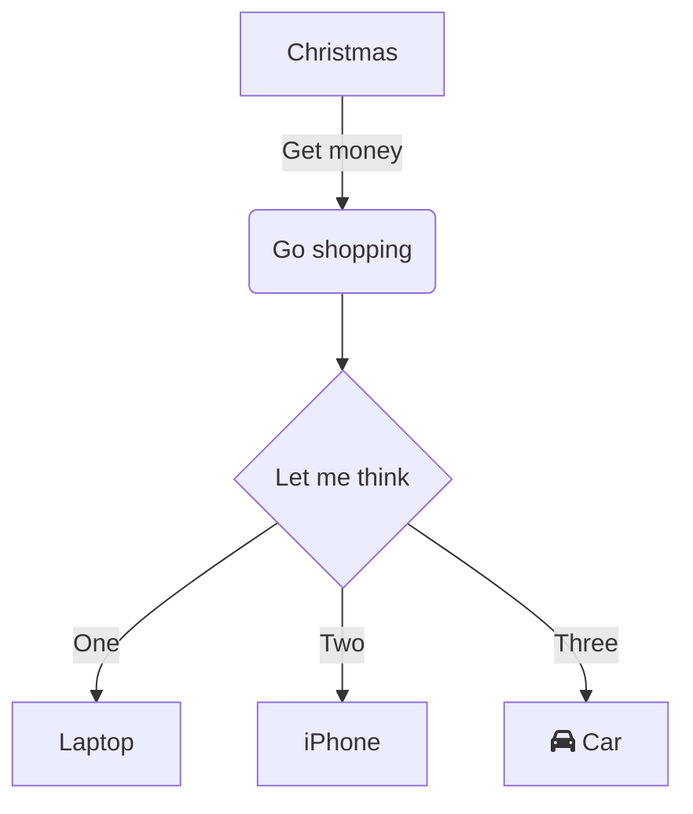
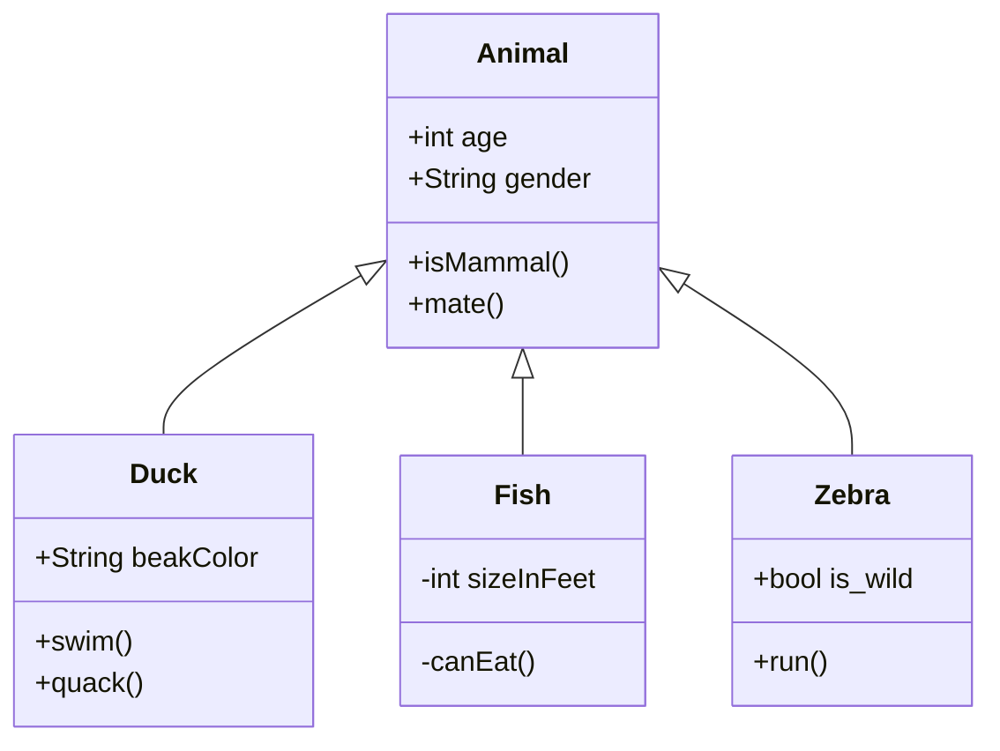
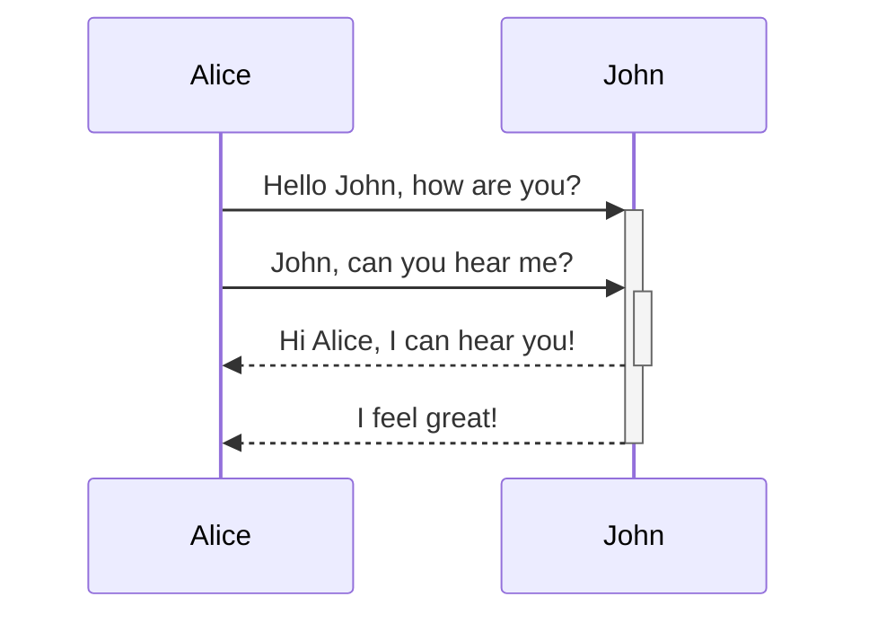
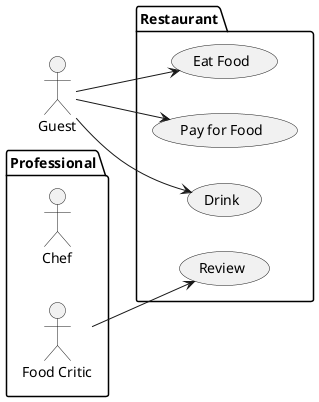

# A One Page Project Doc

_One paragraph project description. This should describe the goal you're trying to accomplish._

# Planning

## License

_Select a [License](https://choosealicense.com/) for the project. Write a sentence why you selected the license. Copy the respective "LICENSE" file from github into the root of the repo._

## Tasks

_Describe how work is partitioned and distributed._

## Version control

_Describe a version control strategy. Will you branch? Will you rebase? How many branches will you maintain? How will versions be labeled?_

## Project Structure

_Describe the file/directory structure of the project_
**No directory or file shall contain: ' ' or a capital letter.**
**- source: contains all source code for the project. Each unit in it's own directory**
**- test: contains all the test code for the project. **
**- test/unit_test: contains all the unit test code for the project. Each unit in it's own directory**
**- test/integration_test: contains all the integration test code for the project. Each test in it's own directory**

## Define a unit

_What is a unit for this project? A function? A class? Something else?_

## Quality

_Describe the quality goals for the project. Is this a prototype? Is this a product?_

### Unit testing

_Describe the unit testing strategy for this project._

### Integration testing

_Describe the integration testing strategy for this project._

## Requirements

### Functional Requirements

_Functional requirements for a simple project should be phrased as usecases. Example can be found in docs._

**Note that mermaid doesn't support usecase diagrams you need to use another tool(draw.io, plantUML) until [this issue](https://github.com/mermaid-js/mermaid/issues/4628) is resolved.**

### Non Functional Requirements

_Non functional requirements should be listed_
_Ex:_
_* Needs to run on the cluster_
_* Needs to run on windows_
_* Can't spend money on tools_

## Technologies

### Languages/Frameworks

_Describe what languages/Frameworks are going to be used in the project. Include links to the languages/Frameworks and setup instructions. Include the reasons you're picking the languages/Frameworks (it's absolutely fine to pick a language because you already know how to work with it)._

#### Style Guide

_Pick a style guide from the internet that includes an autoformatter link that here and use it._

### Tools

_Describe tools (IDE, Debugger, build tools, test framework) you'll use in the project. At a minimum this should include your version control tooling._

# Design and Documentation

**This is the most important section of the document. People talk about documentation as only well commented code. While well commented code is important having diagrams and real english sentences describing what you're trying to do is much more important**

## System

_A block diagram for the entire system._

## Units

### Unit: Title

#### Description
_Describe the point of the unit_

#### Diagrams

_Include some diagrammatic description of the unit. A class diagram? A sequence diagram? A state machine?_

#### Unit test description

_List the unit tests for this unit_

.
.
.

### Unit n: Title

#### Description
_Describe the point of the unit_

#### Diagrams

_Include some diagrammatic description of the unit. A class diagram? A sequence diagram? A state machine?_

#### Unit test description

_List the unit tests for this unit_

# Integration tests

_List the integration tests for the system._

# Resources

Some useful resources:

* [Software engineering : a practitioner's approach by Roger Pressman](https://search.lib.uiowa.edu/permalink/f/9i2ftm/01IOWA_ALMA21322763270002771)
* [GUI Diagraming tool](https://app.diagrams.net/)
* [Plain text diagraming tool](https://mermaid.js.org/config/Tutorials.html)
* [Another plain text diagraming tool](https://plantuml.com/)
---

# Mermaid examples

---

---

---

---
# PlantUML

