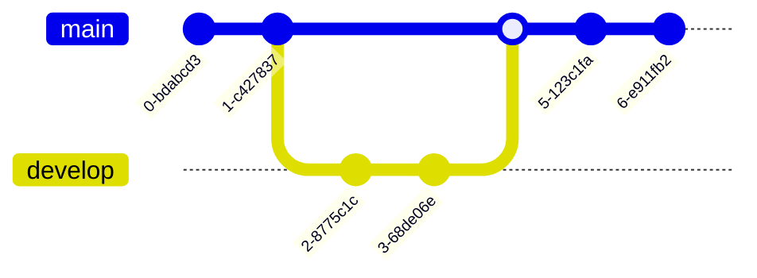
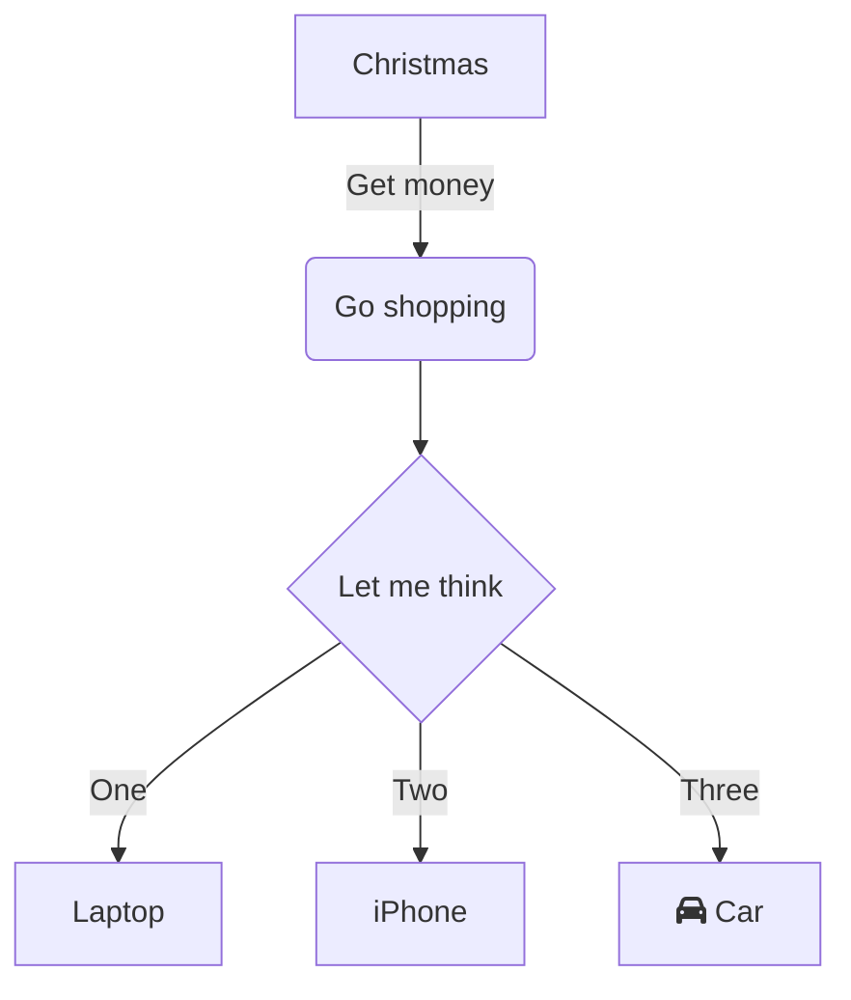
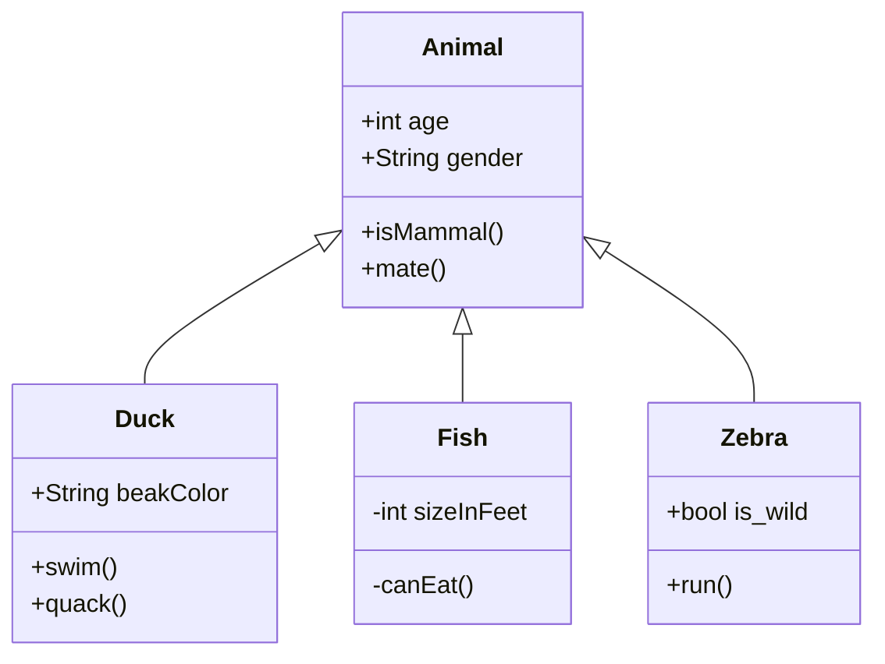
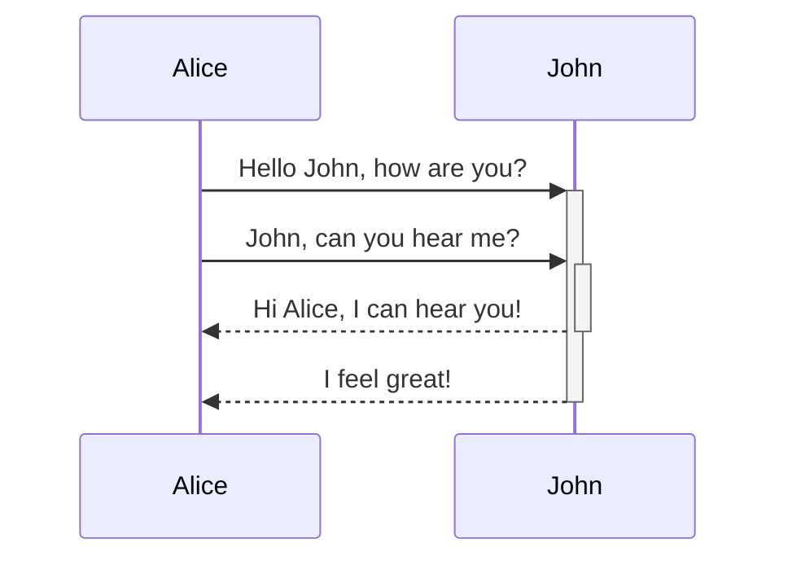
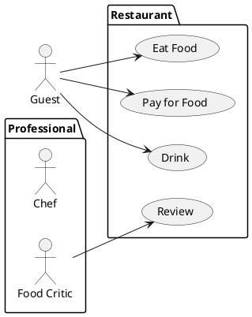

# PaperScout.ai

Design a web application which updates users daily/weekly with a specified number of recently published literature in their fields and provide AI-generated summaries of each article. 

Secondary Project Goals: Provide features to teach young researchers about literature search strategies and provide an option to see the search strategy used for each update.

# Planning

## License
    PaperScout.ai
    Copyright (C) 2025  Elizabeth Elias

    This program is free software: you can redistribute it and/or modify
    it under the terms of the GNU Affero General Public License as
    published by the Free Software Foundation, either version 3 of the
    License, or (at your option) any later version.

    This program is distributed in the hope that it will be useful,
    but WITHOUT ANY WARRANTY; without even the implied warranty of
    MERCHANTABILITY or FITNESS FOR A PARTICULAR PURPOSE.  See the
    GNU Affero General Public License for more details.

    You should have received a copy of the GNU Affero General Public License
    along with this program.  If not, see <https://www.gnu.org/licenses/>.

## Tasks

All work is to be completed by Elizabeth Elias. 

## Version control

_Describe a version control strategy. Will you branch? Will you rebase? How many branches will you maintain? How will versions be labeled?_

## Project Structure

_Describe the file/directory structure of the project_
**No directory or file shall contain: ' ' or a capital letter.**
**- source: contains all source code for the project. Each unit in it's own directory**
**- test: contains all the test code for the project. **
**- test/unit_test: contains all the unit test code for the project. Each unit in it's own directory**
**- test/integration_test: contains all the integration test code for the project. Each test in it's own directory**

## Define a unit

A unit for this project depends on the which category it falls into. 

The categories for this project are as follows: Front End, AI Integration, Messaging, Back End, and database. 

A unit for a Front End component would be considered a page on the website. For example, the sign-up page, user dashboard, and landing pages would each be considered an individual component which includes their UI design and final code using CSS / React. 

Units for the AI, messaging, database components will be considered a function. These categories will likely require a lot of fine tuning and specific steps to ensure that the website can function properly, thus making a granular unit important. Each function should be tested independently and all units will need to be integrated precisely, which will ensure user security, accurate updates to databases, and that information from databases can be accessed correctly. The messaging component will be handling sensitive user information so the smallest unit should be tested to ensure safety of user information and ensure that updates to users are provided as expected and do not add to any confusion young researchers may face when entering their research fields. The database component not only needs to ensure that databases can be accessed and updated correctly, but also stores any user information securely. However, unit tests that ensure all messaging and database functions can function as one entity will be necessary to write as well. 

A unit for the other backend components will be considered a class. Backend components not associated with the messaging or database components will likely need to function as objects, so the individual functions within those classes will need to function together intitially to make the website functional. Additionally, the actual databases themselves will be considered their own unit in addition to the associated functions that will be used to access and update each respective database.

## Quality

The goal of this project is to provide the design documents to turn this into a high-quality product. Becuase this product would be targeted towards young researchers who may not be experienced in navigating databases and intends to help them learn to do so, the user interface should be very simple and straightforward to ensure that access to information this app provides is always easily accessible by users and viewing searches and past updates should be straightfoward and simple. 

### Unit testing

Unit testing for PaperScout will focus on modular testing of both front and backend components in functional isolation. Each unit will be designed to have testable interfaces, mockable dependencies, and clear I/Os. By designing unit tests with this in mind, ensures that the most critical workflows for the system (user registraion, query submission, article summarization, and user notification) function properly against edge cases and integration errors. 

#### Frontend (React-based):
* Use Jest and React Testing Library to test component rendering and interactability
* Mock API responses and user actions
* Validate routing, form inputs, conditional rendering, and responsiveness

#### Backend (Python/FastAPI):
* Pytest for logic validation
* Unittest.mock for mocking external dependencies
* Test individual service functions, database access layers, and API endpoints

#### Databases:
* Insert, update, retrieve, and delete tests
    * Implement rollback after each test as well
* Verify constraints
    * Constraints to consider: uniqueness, nullability, and foreign keys

#### Database API & AI Integration
* Mock PubMed API responses
* Mock arXiv API responses
* Mock PubMed API request
* Mock arXiv API request
* Validate summarization functions including structure and length
* Ensure fallbacks behave during API timeouts or malformed inputs

#### Automation and CI
* Integrate all test suites into GitHub Actions to allow for CI/CD
* Tests run automatically on pull requests
* Code coverage tracked with Codecov

#### Goals

* Maintain >90% code coverage
* Catch edge cases early in development
* Enable refactoring easily

### Integration testing

_Describe the integration testing strategy for this project._

## Requirements

### Functional Requirements

_Functional requirements for a simple project should be phrased as usecases. Example can be found in docs._

**Note that mermaid doesn't support usecase diagrams you need to use another tool(draw.io, plantUML) until [this issue](https://github.com/mermaid-js/mermaid/issues/4628) is resolved.**

### Non Functional Requirements

_Non functional requirements should be listed_
_Ex:_
_* Needs to run on the cluster_
_* Needs to run on windows_
_* Can't spend money on tools_

## Technologies

### Languages/Frameworks

_Describe what languages/Frameworks are going to be used in the project. Include links to the languages/Frameworks and setup instructions. Include the reasons you're picking the languages/Frameworks (it's absolutely fine to pick a language because you already know how to work with it)._

#### Style Guide

_Pick a style guide from the internet that includes an autoformatter link that here and use it._

### Tools

_Describe tools (IDE, Debugger, build tools, test framework) you'll use in the project. At a minimum this should include your version control tooling._

# Design and Documentation

**This is the most important section of the document. People talk about documentation as only well commented code. While well commented code is important having diagrams and real english sentences describing what you're trying to do is much more important**

## System

## Units

### Unit 1: Landing Page (Front End)

#### Description
Summarizes PaperScout.ai and directs users to log-in or sign up. 

#### Diagrams

Sequence Diagram: User -> Browser -> React App -> Route Redirect

#### Unit test description

1. Renders components correctly
2. Buttons to login/signup work
3. Responsive layout, content loads

### Unit 2: About App Page (Front End)

#### Description

Educates users about the app's goals, how it works, and its benefits to researchers.

#### Diagrams

Class Diagram showing static content component tree

#### Unit test description

1. Renders static content
2. Responsive behavior

### Unit 3: About Developer Page (Front End)

#### Description

Displays developer bio and contact information, possibly including GitHub or portfolio.

#### Diagrams

Class Diagram of static content

#### Unit test description

1. Component renders properly
2. Contains links to Elizabeth's github

### Unit 4: Sign Up Page (Front End)

#### Description

Allows new users to create an account.

#### Diagrams

Sequence Diagram: User -> Signup Form -> API -> User DB

#### Unit test description

1. Valid input accepted
2. Invalid input shows errors
3. Form submits to backend
4. Redirects to login

### Unit 5: Login Page (Front End)

#### Description

Authenticates returning users.

#### Diagrams

State Machine: Logged Out -> Logging In -> Authenticated

#### Unit test description

1. Valid credentials accepted
2. Invalid credentials show error
3. Redirects on success

### Unit 6: User Dashboard (Front End)

#### Description

Central hub for viewing updates, saved searches, and navigating features.

#### Diagrams

Component Hierarchy (Dashboard, Update Feed, NavBar)

#### Unit test description

1. Loads user-specific data
2. Interacts with update and search history components

### Unit 7: User Profile (Front End)

#### Description

Displays and allows editing of user preferences and scheduling options.

#### Diagrams

State Machine: View Mode <-> Edit Mode

#### Unit test description

1. Fields render properly
2. Edit mode saves to backend

### Unit 8: Search History Page (Front End)

#### Description

Lists user’s past queries and links to associated summaries. Also lists articles returned from each queries and their relevant information (authors, DOI, database). Allows past queries to be edited. 

#### Diagrams

Sequence Diagram: User -> UI -> Query DB

#### Unit test description

1. Query history renders
2. Links to past summaries work
3. Relevant article info properly displayed
4. Users can option prevoius search options

### Unit 9: New Query Page (Front End)

#### Description

Form for users to define and submit a new literature search.

#### Diagrams

Sequence Diagram: User -> Query Form -> API -> PubMed/arXiv

#### Unit test description

1. Input validation
2. Successful submission triggers backend fetch

### Unit 10: Previous Search Page (Front End)

#### Description

Shows results for a selected previous query.

#### Diagrams

Component Hierarchy: Metadata + Summary Cards

#### Unit test description

1. Displays correct search results
2. Navigation back to dashboard works

### Unit 11: User Database (Backend, Databases)

#### Description

Stores user information including email, hashed password, preferences, and delivery schedule.

#### Diagrams

Class Diagram: User(id, email, password_hash, preferences, schedule)
Sequence Diagram: SignUp/Login -> API -> User DB (SELECT/INSERT)

#### Unit test description

1. Insert new user
2. Validate password hashing
3. Retrieve user by email
4. Update preferences

### Unit 12: User Feedback Database (Backend, Databases)

#### Description

Captures user-submitted feedback including satisfaction scores and suggestions for improvement.

#### Diagrams

Class Diagram: Feedback(id, user_id, timestamp, rating, comment)
Sequence Diagram: Submit Feedback -> API -> Feedback DB (INSERT)

#### Unit test description

1. Add valid feedback
2. Enforce required fields
3. Retrieve feedback by user/date

### Unit 13: Search History Database (Backend, Databases)

#### Description

Logs all search queries made by a user, along with metadata and result summaries.

#### Diagrams

Class Diagram: SearchHistory(id, user_id, query, timestamp, summary_ref)
Sequence Diagram: Submit Query -> API -> Search History DB (INSERT)

#### Unit test description

1. Insert search history
2. Retrieve history by user
3. Delete/clean up old history entries

### Unit 14: Scheduler Database (Backend, Databases)

#### Description

Manages scheduling preferences for article updates (e.g., frequency, next update time).

#### Diagrams

Class Diagram: Scheduler(id, user_id, frequency, next_update, last_run)
State Machine: Active -> Scheduled -> Triggered -> Updated

#### Unit test description

1. Add/update scheduler entry
2. Compute next run time
3. Fetch scheduler job by user ID

### Unit 15: Dashboard Interactivity (Backend, User Workflow)

#### Description

Handles user input on dashboard (e.g., feedback on articles, bookmarking, editing settings).

#### Diagrams

Sequence Diagram: User -> Dashboard -> API -> DB Updates

#### Unit test description

1. Save feedback from dashboard
2. Bookmark an article
3. Edit search preferences

### Unit 16: Dashboard Display (Backend, User Workflow)

#### Description

Populates the frontend dashboard with user-specific update summaries and profile data.

#### Diagrams

Class Diagram: DashboardData(UserInfo, UpdateSummaries, SchedulerInfo)
Sequence Diagram: User -> Dashboard Load -> API -> DB Reads

#### Unit test description

1. Correct data shown for each user
2. Returns recent updates only
3. Handles edge cases (no updates, missing profile)

### Unit 17: User Login (Backend, User Workflow)

#### Description

Authenticates users using their credentials and manages session tokens.

#### Diagrams

Sequence Diagram: Login Request -> Auth Service -> Token Generation -> Response
State Machine: Logged Out -> Auth Validated -> Logged In

#### Unit test description

1. Correct login with valid credentials
2. Deny access with invalid credentials
3. Token returned and stored securely

### Unit 18: User Sign Up (Backend, User Workflow)

#### Description

Registers new users and inserts their credentials and preferences into the system.

#### Diagrams

Sequence Diagram: Form Submit -> API -> User DB (INSERT)

#### Unit test description

1. Validate all required fields
2. Ensure email uniqueness
3. Verify email
4. Store encrypted password

### Unit 19: New Query (Backend, User Workflow)

#### Description

Takes new search queries, calls literature APIs, stores query, and returns results.

#### Diagrams

Sequence Diagram: Submit Query -> API -> PubMed/arXiv -> Summary + Store Query -> Return Results

#### Unit test description

1. Store query string
2. Return articles from API
3. Store metadata and summary reference

### Unit 20: User Profile (Backend, User Workflow)

#### Description

Manages user profile updates such as preferred fields, summary frequency, and contact info.

#### Diagrams

Class Diagram: Profile(id, user_id, fields_of_interest, schedule)
Sequence Diagram: View/Edit Profile -> API -> DB (SELECT/UPDATE)

#### Unit test description

1. Profile loads with correct data
2. Update preferences saved
3. Missing fields show default values

### Unit 21: Search History (Backend, User Workflow)

#### Description

Retrieves a user's previous queries and associated metadata for display and re-use.

#### Diagrams

Sequence Diagram: Dashboard -> API -> Search History DB -> Return past queries

#### Unit test description

1. Fetch history by user
2. Return most recent searches first
3. Handle empty history case

### Unit 22: User Feedback (Backend, User Workflow)

#### Description

Collects and processes user feedback submitted through the interface.

#### Diagrams

Sequence Diagram: Feedback Form -> API -> Feedback DB

#### Unit test description

1. Accept valid feedback
2. Reject malformed feedback
3. Store metadata (timestamp, user ID)
   
### Unit 23: Update Notifications (Backend, Messaging)

#### Description

Sends update summaries via email or in-app notifications based on user schedules.

#### Diagrams

Sequence Diagram: Cron Job -> Scheduler DB -> Generate Update -> Send Notification
State Machine: Scheduled -> Triggered -> Sent

#### Unit test description

1. Triggered on schedule
2. Sends correct content
3. Logs notification status

### Unit 24: PubMed API (Backend, API)

#### Description

Connects to PubMed to retrieve articles based on user-defined queries.

#### Diagrams

Sequence Diagram: Query -> API Wrapper -> PubMed -> Return Article Metadata

#### Unit test description

1. Alternate queries execute correctly
2. Error fallback works
3. Metadata returned is accurate

### Unit 25: arXIV API (Backend, API)

#### Description

Interfaces with arXiv to retrieve relevant preprints matching user queries.

#### Diagrams

Sequence Diagram: Query -> arXiv Wrapper -> arXiv -> Parse + Return Metadata

#### Unit test description

1. Generate valid query syntax
2. Parse arXiv XML responses
3. Handle missing or malformed data

### Unit 26: Article Selection & Summarization (Backend, API/AI/Messaging)

#### Description

Filters retrieved articles and generates concise, readable AI summaries for each.

#### Diagrams

Sequence Diagram: API Response -> Summarizer Module -> Summary + Key Points
State Machine: Raw Article -> Selected -> Summarized

#### Unit test description

1. Selects top articles per user/topic
2. Summaries under word limit
3. Validate NLP pipeline outputs

### Unit 27: Search Query Optomization (Backend, AI Integration)

#### Description

Improves user queries via NLP techniques to enhance article retrieval relevance.

#### Diagrams

Class Diagram: QueryOptimizer(InputAnalyzer, SynonymExpander)
Sequence Diagram: User Query -> Optimizer -> PubMed/arXiv

#### Unit test description

1. Outputs improved queries
2. Handles edge cases (stop words, short queries)
3. Boosts match rate in test cases

### Unit 28: Update Formatting (Backend, Messaging)

#### Description

Converts selected articles and summaries into a user-friendly update message format (HTML/email/in-app).

#### Diagrams

Class Diagram: UpdateFormatter(TemplateEngine, MarkdownRenderer)
Sequence Diagram: Summaries -> Formatter -> Email/In-app Payload

#### Unit test description

1. Format summary blocks cleanly
2. Escape special characters
3. Include links and metadata

### Unit 29: Admin Capabilities (Backend)

#### Description

Provides admin-level tools for managing users, monitoring system usage, and updating content settings.

#### Diagrams

Class Diagram: AdminTools(UserManager, FeedbackReview, SchedulerOverride)
State Machine: View -> Select User -> Take Action (Ban, Reschedule, Delete)

#### Unit test description

1. Admin actions authorized only
2. Retrieve user/search logs
3. Modify schedules or purge data

### Unit 30: Access Information from Scheduler Database (Backend, Databases)

#### Description

Fetches user-specific scheduling data for determining when to send update notifications.

#### Diagrams

Sequence Diagram: Scheduler Service -> Scheduler DB -> Return Frequency/Time

#### Unit test description

1. Query scheduler info by user ID
2. Handle missing or invalid IDs
3. Confirm correct data formatting

### Unit 31: Access Information from User Database (Backend, Databases)

#### Description

Retrieves user metadata such as preferences, contact info, and login credentials.

#### Diagrams

Class Diagram: User(id, email, preferences, schedule)
Sequence Diagram: Profile Load/Login -> User DB

#### Unit test description

1. Return correct user on query
2. Handle non-existent user
3. Mask sensitive fields where necessary

### Unit 32: Access Information from Search History Database (Backend, Databases)

#### Description

Allows retrieval of all prior user search queries, useful for both frontend display and backend analytics.

#### Diagrams

Sequence Diagram: Load Search History -> Search DB -> Return Query List

#### Unit test description

1. Fetch history by user
2. Handle no-history case
3. Ensure time-based ordering

### Unit 33: Access Information from Feedback Database (Backend, Databases)

#### Description

Retrieves user-submitted feedback for review and analysis.

#### Diagrams

Sequence Diagram: Admin Panel -> Feedback DB -> Return Feedback Records

#### Unit test description

1. Pull feedback entries
2. Support filtering by user/timestamp
3. Validate completeness of data

### Unit 34: Update information from scheduler database (Backend, Databases)

#### Description

Updates existing scheduler entries, e.g., modifying frequency or resetting timers after an update.

#### Diagrams

Sequence Diagram: Cron Job/Event -> Scheduler DB (UPDATE)

#### Unit test description

1. Update by scheduler ID
2. Ensure data integrity (valid frequencies only)
3. Handle concurrent updates

### Unit 35: update information from user database (Backend, Databases)

#### Description

Applies edits to user profiles such as preferences, scheduling frequency, or contact details.

#### Diagrams

Class Diagram: EditableUser(id, preferences, contact_info)
Sequence Diagram: Save Profile -> User DB (UPDATE)

#### Unit test description

1. Validate input before update
2. Update only allowed fields
3. Confirm persistence

### Unit 36: Update information from search history database (Backend, Databases)

#### Description

Enables adding metadata or tagging previous search history entries post-query (e.g., adding relevance scores).

#### Diagrams

Sequence Diagram: Scoring Job -> Search DB (UPDATE)

#### Unit test description

1. Update correct entry by ID
2. Reject invalid metadata formats
3. Ensure history record integrity

### Unit 37: Update information from feedback database (Backend, Databases)

#### Description

Adds administrative notes or flags to existing feedback records for moderation or follow-up.

#### Diagrams

Class Diagram: FeedbackEntry(id, user_id, comment, status_flag)

#### Unit test description

1. Modify comment metadata (e.g., status)
2. Enforce permission checks
3. Audit change logs

### Unit 38: Encryt password (Backend, Databases)

#### Description

Hashes user passwords before storing them in the database to ensure secure authentication.

#### Diagrams

Sequence Diagram: Sign Up -> Hash Function -> User DB (INSERT hashed_pw)

#### Unit test description

1. Hashing function applied correctly
2. Ensure hash is not reversible
3. Compare hashed values during login

### Unit 39: Create new scheduler item (Backend, Databases)

#### Description

Creates a new entry in the scheduler database when a user adds a new search query or modifies a search query. 

#### Diagrams

Sequence Diagram: Signup/Profile Save -> Scheduler DB (INSERT)

#### Unit test description

1. Accept valid input for frequency/time
2. Validate scheduler entry format
3. Reject duplicates or conflicting entries
4. If existing search updated, scheduler deletes previous entry

### Unit 40: Create new user (Backend, Databases)

#### Description

Handles the creation of a new user account in the database during the signup process, storing all necessary information such as email, hashed password, and preferences.

#### Diagrams

Sequence Diagram: Sign Up Form -> API -> User DB (INSERT)
Class Diagram: User(id, email, password_hash, preferences, created_at)

#### Unit test description

1. Accept valid new user data
2. Hash password before insert
3. Enforce email uniqueness
4. Reject incomplete/malformed entries
   
### Unit 41: Create new search history item (Backend, Databases)

#### Description

Creates a new record in the search history database each time a user submits a new query, including timestamp and query metadata.

#### Diagrams

Sequence Diagram: New Query Submit -> API -> Search History DB (INSERT)
Class Diagram: SearchHistory(id, user_id, query_string, timestamp, result_ref)

#### Unit test description

1. Insert new search entry with valid data
2. Confirm association with correct user ID
3. Handle optional fields (e.g., result references)
4. Timestamp generation and format checks

### Unit 42: Create new feedback item (Backend, Databases)

#### Description

Inserts new user feedback (comments, ratings) into feedback database for future analysis and improvements.

#### Diagrams

Sequence Diagram: Frontend -> API -> Feedback Table (INSERT)

#### Unit test description

1. Valid feedback is added
2. Invalid feedback triggers error
3. Required fields enforced

# Integration tests

_List the integration tests for the system._

# Resources

Some useful resources:

* [Software engineering : a practitioner's approach by Roger Pressman](https://search.lib.uiowa.edu/permalink/f/9i2ftm/01IOWA_ALMA21322763270002771)
* [GUI Diagraming tool](https://app.diagrams.net/)
* [Plain text diagraming tool](https://mermaid.js.org/config/Tutorials.html)
* [Another plain text diagraming tool](https://plantuml.com/)
---

# Mermaid examples

```mermaid
gitGraph
    commit
    commit
    branch develop
    checkout develop
    commit
    commit
    checkout main
    merge develop
    commit
    commit
```
---

```mermaid
flowchart TD
    A[Christmas] -->|Get money| B(Go shopping)
    B --> C{Let me think}
    C -->|One| D[Laptop]
    C -->|Two| E[iPhone]
    C -->|Three| F[fa:fa-car Car]
```
---

```mermaid
classDiagram
    Animal <|-- Duck
    Animal <|-- Fish
    Animal <|-- Zebra
    Animal : +int age
    Animal : +String gender
    Animal: +isMammal()
    Animal: +mate()
    class Duck{
      +String beakColor
      +swim()
      +quack()
    }
    class Fish{
      -int sizeInFeet
      -canEat()
    }
    class Zebra{
      +bool is_wild
      +run()
    }
```
---

```mermaid
sequenceDiagram
    Alice->>+John: Hello John, how are you?
    Alice->>+John: John, can you hear me?
    John-->>-Alice: Hi Alice, I can hear you!
    John-->>-Alice: I feel great!
```
---
# PlantUML

```plantuml
@startuml
left to right direction
actor Guest as g
package Professional {
  actor Chef as c
  actor "Food Critic" as fc
}
package Restaurant {
  usecase "Eat Food" as UC1
  usecase "Pay for Food" as UC2
  usecase "Drink" as UC3
  usecase "Review" as UC4
}
fc --> UC4
g --> UC1
g --> UC2
g --> UC3
@enduml


```
