# PaperScout.ai

Design a web application which updates users daily/weekly with a specified number of recently published literature in their fields and provide AI-generated summaries of each article. 

Secondary Project Goals: Provide features to teach young researchers about literature search strategies and provide an option to see the search strategy used for each update.

# Planning

## License
    PaperScout.ai
    Copyright (C) 2025  Elizabeth Elias

    This program is free software: you can redistribute it and/or modify
    it under the terms of the GNU Affero General Public License as
    published by the Free Software Foundation, either version 3 of the
    License, or (at your option) any later version.

    This program is distributed in the hope that it will be useful,
    but WITHOUT ANY WARRANTY; without even the implied warranty of
    MERCHANTABILITY or FITNESS FOR A PARTICULAR PURPOSE.  See the
    GNU Affero General Public License for more details.

    You should have received a copy of the GNU Affero General Public License
    along with this program.  If not, see <https://www.gnu.org/licenses/>.

## Tasks

All work is to be completed by Elizabeth Elias. 

## Version control

### Branch Types:
<code>main</code>: Deployments are made from main branch, only contains production-ready code.
<code>develop</code>: Feature-integration branch, new features and bug fixes are merged here before being merged onto <code>main</code>. 
Feature branches: Branched from <code>develop</code> for new features and feature improvements.
Bug branches: Branched from <code>develop</code> to address bugs in the code. 

### Merging and Rebasing
Feature, bug branches: Rebase regularly onto develop to minimize merge conflicts and stay on track with updates
Merge to <code>develop</code>: Use PRs for merging. Prior to merging, ensure code review and automated tests pass. 
Merge to <code>main</code>: Once develop is ready for release, use a PR to merge onto main

### Version Labeling
Use [Semantic Versioning](https://semver.org/) in standard <code>MAJOR.MINOR.PATCH</code> format
1. MAJOR version when you make incompatible API changes
2. MINOR version when you add functionality in a backward compatible manner
3. PATCH version when you make backward compatible bug fixes

## Project Structure

_Describe the file/directory structure of the project_
**No directory or file shall contain: ' ' or a capital letter.**
**- source: contains all source code for the project. Each unit in it's own directory**
**- test: contains all the test code for the project. **
**- test/unit_test: contains all the unit test code for the project. Each unit in it's own directory**
**- test/integration_test: contains all the integration test code for the project. Each test in it's own directory**

## Define a unit

A unit for this project depends on the which category it falls into. 

The categories for this project are as follows: Front End, AI Integration, Messaging, Back End, and database. 

A unit for a Front End component would be considered a page on the website. For example, the sign-up page, user dashboard, and landing pages would each be considered an individual component which includes their UI design and final code using CSS / React. 

Units for the AI, messaging, database components will be considered a function. These categories will likely require a lot of fine tuning and specific steps to ensure that the website can function properly, thus making a granular unit important. Each function should be tested independently and all units will need to be integrated precisely, which will ensure user security, accurate updates to databases, and that information from databases can be accessed correctly. The messaging component will be handling sensitive user information so the smallest unit should be tested to ensure safety of user information and ensure that updates to users are provided as expected and do not add to any confusion young researchers may face when entering their research fields. The database component not only needs to ensure that databases can be accessed and updated correctly, but also stores any user information securely. However, unit tests that ensure all messaging and database functions can function as one entity will be necessary to write as well. 

A unit for the other backend components will be considered a class. Backend components not associated with the messaging or database components will likely need to function as objects, so the individual functions within those classes will need to function together intitially to make the website functional. Additionally, the actual databases themselves will be considered their own unit in addition to the associated functions that will be used to access and update each respective database.

## Quality

The goal of this project is to provide the design documents to turn this into a high-quality product. Becuase this product would be targeted towards young researchers who may not be experienced in navigating databases and intends to help them learn to do so, the user interface should be very simple and straightforward to ensure that access to information this app provides is always easily accessible by users and viewing searches and past updates should be straightfoward and simple. 

### Unit testing

Unit testing for PaperScout will focus on modular testing of both front and backend components in functional isolation. Each unit will be designed to have testable interfaces, mockable dependencies, and clear I/Os. By designing unit tests with this in mind, ensures that the most critical workflows for the system (user registraion, query submission, article summarization, and user notification) function properly against edge cases and integration errors. 

#### Frontend (React-based):
* Use [Jest](https://jestjs.io/) and [React Testing Library](https://testing-library.com/docs/react-testing-library/intro/) to test component rendering and interactability
* Mock API responses and user actions
* Validate routing, form inputs, conditional rendering, and responsiveness

#### Backend (Python/FastAPI):
* [Pytest](https://docs.pytest.org/en/stable/) for logic validation
* [Unittest.mock](https://docs.python.org/3/library/unittest.mock.html) for mocking external dependencies
* Test individual service functions, database access layers, and API endpoints

#### Databases:
* Insert, update, retrieve, and delete tests
    * Implement rollback after each test as well
* Verify constraints
    * Constraints to consider: uniqueness, nullability, and foreign keys
* Create model tests, view tests, form tests, and constraint tests for DJango with [Unittest.mock](https://docs.python.org/3/library/unittest.mock.html) 

#### Database API & AI Integration
* Mock PubMed API responses
* Mock arXiv API responses
* Mock PubMed API request
* Mock arXiv API request
* Validate summarization functions including structure and length
* Ensure fallbacks behave during API timeouts or malformed inputs

#### Automation and CI/CD
* Integrate all test suites into GitHub Actions to allow for CI/CD
* Tests run automatically on pull requests
* Code coverage tracked with [Coveralls](https://coveralls.io/)

#### Goals
* Maintain >90% code coverage
* Catch edge cases early in development
* Enable refactoring easily
* Focus on critical unit features (those with potential to alter system behavior)
* Robust error handling by ensuring fallbacks exist and function correctly

### Integration testing

Integration testing for PaperScout will focus on verifying correct interaction between key system componenets (i.e. frontend and backend, backend and external APIs, backend and databases) and ensuring fallback for any errors is correctly implemented. Integration tests should ensure all components function together as expected and mimic real-world workflows across multiple units within the system. 

#### E2E testing
* User workflow
    * User sign-up and login
    * Submit a new query
    * Recieve summarized results
    * Scheduler triggers updates and sends notifications
    * User logout
* Updates to queries are handled correctly
* Deleted queries remove updates from scheduler but maintains search history
* Users can optionally send feedback and have that properly handled by feedback DB and subsequently used to optimize article selection, summarization, and search terms.
  
#### Mock APIs as needed
* Use live databases and backend logic
* Stimulate PubMed/arXiv responses with controlled mock instances to ensure stability and reproducability
    * Use [responses](https://pypi.org/project/responses/0.6.1/) to mock PubMed/arXiv endpoints

#### Frontend-backend integration
* Stimulate user interactions from browser to API using [Cypress](https://www.cypress.io/)
* Validate network request payloads
* Validate network responses
* Validate network DOM updates

#### Database validation
* Ensure search history is updated when scheduler sends an update to user
* Ensure scheduler prompts user for feedback and updates feedback database with appropriate query ID
* Ensure scheduler entries are created when user creates a new query
    * Ensure scheduler updates appropriately when a previous query is edited or deleted
* Ensure all datases are updated correctly through integrated API endpoints
* Create a PostgreSQL test DB to ensure proper backend integration

#### AI pipeline
* Test article selection relevance based on search terms
* Test summarization acccuracy with predefined inputs
* Check AI structure, content, and delivery logic
* Check AI can access search terms, query results, and user feedback for appropriate queries

#### Automation and CI/CD
* Use GitHub Actions workflows for parallel execution of full frontend/backend stack
* Run integration tests on major feature branches
  
#### Goals
* Ensure stability and correctness of E2E, full-stack user journey
* Catch errors missed by isolated unit tests
* Validate third-party integrations function correctly
* Validate robustness of ML modules
* Improve overall system reliability
* Ensure compatability between components
  

## Requirements

### Functional Requirements

1. User Registration, User Authentication
   * Use Case: Allow users to create an account using a unique email and secure password
   * Use Case: Enable users to log in and out of their account securely
2. Profile Management
   * Use Case: Allows users to update personal information
   * Use Case: enables users to update delivery method information (email/SMS)
3. Search Query Submission
   * Use Case: Allows user to input required and preferred search terms related to their research field
   * Use Case: Allows users to receive an AI generated query based on research interests
   * Use Case: Allows users to fully or partially opt out of AI integration
   * Use Case: Allows users to input a full search query
   * Use Case: Provides suggestions for additional relevant search terms
   * Use Case: Allows users to set preferences for update frequency and delivery method for a search query
   * Use Case: Allows users to delete and edit queries
   * Use Case: Allows users to view past articles retrieved and past searches run
4. Automated Literature Retrieval
   * Use Case: System accesses PubMed and/or arXiv databases based on user defined search terms and retrieves relevant articles
   * Use Case: System determines correct number of relevant articles (based on user preferences) for user update. Relevance is determined based on provided search query and ay user feedback provided.
   * Use Case: System generates AI-based summaries for each retrieved article
   * Use Case: Articles selected for delivery are formatted in a user-friendly manner and sent to user by preferred delivery method
5. Update Delivery
   * Use Case: Users are sent updates containing a specific number of article summaries via their preferred delivery method on a user-defined schedule
   * Use Case: Includes links to full articles in updates and options to provide feedback on relevance of results and relevance of AI-generated summary
6. Search Strategy Transparency
    * Use Case: Allows users to view the specific search strategy that was used for each update
7. User Feedback
   * Use Case: Users are prompted to provide optional feedback on the accuracy and relevance of search results
   * Use Case: System uses feedback to refine future search strategies, improve result relevance, and improve article summarization

### Non Functional Requirements

1. User interface should be intuitive and accessible
2. All user data should be encrypted at rest and in transit
3. Robust authentication mechanisms should be implemented to prevent unathorized access
4. System should process and deliver updates within 2 minutes of scheduled time
5. Only open-source tools and frameworks should be used to avoid licensing costs.
   
## Technologies

### Languages

#### Python: Backend development, scripting, AI integration
* [Python](https://www.python.org/)
* Setup: <code>brew install python3</code> (macOS)
    * Use <code>venv</code> for virutal environment setup
* Reason for selection: Developer is very familiar with the language, it is widely used for ML, and supports FastAPI
  
#### JavaScript (React): Frontend development
* [JavaScript](https://developer.mozilla.org/en-US/docs/Web/JavaScript)
* Setup: <code>npx create-react-app paperscout</code>
* Reason for selection: Built for dynamic and interactive web applications, rendering is efficient, and is designed to be easy to test. Expect it to also integrate smoothly with REST APIs and known for component-based flexbility. 
  
#### SQL (SQLite for Dev, PostgreSQL for Prod): Database design
* [SQLite](https://sqlite.org/), [PostgreSQL](https://www.postgresql.org/)
* Setup: <code>brew install sqlite</code> (macOS)
* Reason for selection: Developer familiarity with language, PostgreSQL is scalable and secure

### Frameworks

#### FastAPI
* [FastAPI](https://fastapi.tiangolo.com/)
* Setup: <code>pip install "fastapi[all]" uvicorn</code>
* Reason for selection: Flexibility, supports asyncohonization, based on standard python type hints

#### React
* React: [React](https://react.dev/)
* Setup: <code>npx create-react-app paperscout</code>
* Reason for selection: User familiarity and component-based flexbility

#### Style Guide
<strong>Python:</strong> [PEP 8](https://peps.python.org/pep-0008/)
    Autoformatter: [autopep8](https://pypi.org/project/autopep8/) 
<strong>JS/React:</strong> [AirBnB](https://airbnb.io/javascript/react/)
    Autoformatter: [prettier](https://www.npmjs.com/package/prettier)

### Tools

IDE: VSCode with Python + React plugins 

Version Control: Git, GitHub 

Debugger: VSCode Debug Console, [ipdb](https://pypi.org/project/ipdb/) 

Dev Tools: [Chrome Dev Tools](https://developer.chrome.com/docs/devtools) 

Messaging:[Email with Postmark](https://postmarkapp.com/lp/postmark-email-api?utm_source=google&utm_medium=cpc&utm_campaign=Postmark_Google_Search_Non_NORTHAM&utm_adgroup=Dev_Languages&utm_term=python%20email&gad_source=1&gclid=Cj0KCQjwqv2_BhC0ARIsAFb5Ac9cp3TYZI4Ws19WmbI7WXwAd84Z6FkKoe-2NpT0yE0HgDHyZPZKHuUaAqMoEALw_wcB), [SMS with Plivo](https://www.plivo.com/) 

Task Scheduler: [CronJob](https://kubernetes.io/docs/concepts/workloads/controllers/cron-jobs/) 

External APIs: [PubMed E-utilities](https://www.ncbi.nlm.nih.gov/books/NBK3837/), [arXIV API](https://info.arxiv.org/help/api/index.html), [OpenAI GPT-4](https://openai.com/index/gpt-4-api-general-availability/) 

Testing Frameworks:
* Frontend Unit Testing: [Jest](https://jestjs.io/), [React Testing Library](https://testing-library.com/docs/react-testing-library/intro/) 
* Backend Unit Testing: [Pytest](https://docs.pytest.org/en/stable/), [Unittest.mock](https://docs.python.org/3/library/unittest.mock.html) 
* Integration Testing: [Pytest](https://docs.pytest.org/en/stable/), [FastAPI TestClient](https://fastapi.tiangolo.com/reference/testclient/)
* E2E Testing: [Cypress](https://www.cypress.io/)

Coverage: [Coveralls](https://coveralls.io/) 

CI/CD: [GitHub Actions](https://github.com/features/actions) 

Containerization: [Docker](https://www.docker.com/) 

Cloud Hosting (budget dependent): [Render](https://render.com/) 

# Design and Documentation

**This is the most important section of the document. People talk about documentation as only well commented code. While well commented code is important having diagrams and real english sentences describing what you're trying to do is much more important**

## System

## Units

### Unit 1: Landing Page (Front End)

#### Description
Summarizes PaperScout.ai and directs users to log-in or sign up. 

#### Diagrams

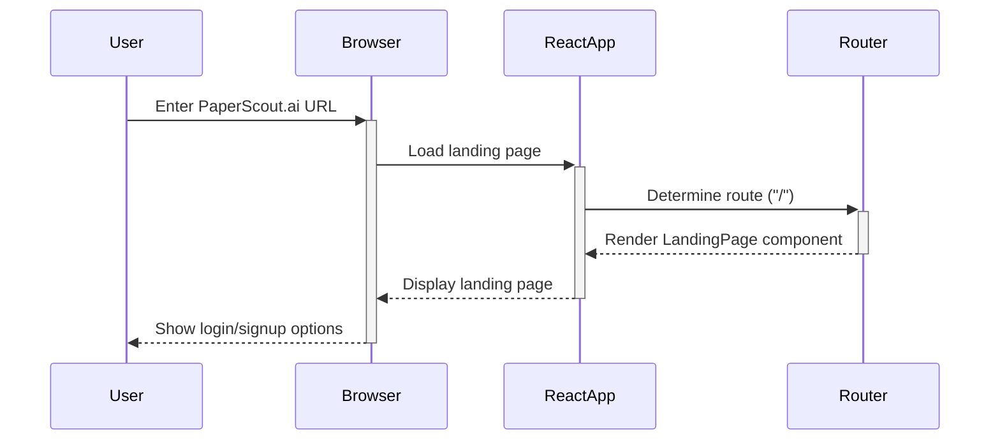
```mermaid
sequenceDiagram
    participant User
    participant Browser
    participant ReactApp
    participant Router

    User->>+Browser: Enter PaperScout.ai URL
    Browser->>+ReactApp: Load landing page
    ReactApp->>+Router: Determine route ("/")
    Router-->>-ReactApp: Render LandingPage component
    ReactApp-->>-Browser: Display landing page
    Browser-->>-User: Show login/signup options
```

#### Unit test description

1. Renders components correctly
2. Buttons to login/signup work
3. Responsive layout, content loads

### Unit 2: About App Page (Front End)

#### Description

Educates users about the app's goals, how it works, and its benefits to researchers.

#### Diagrams

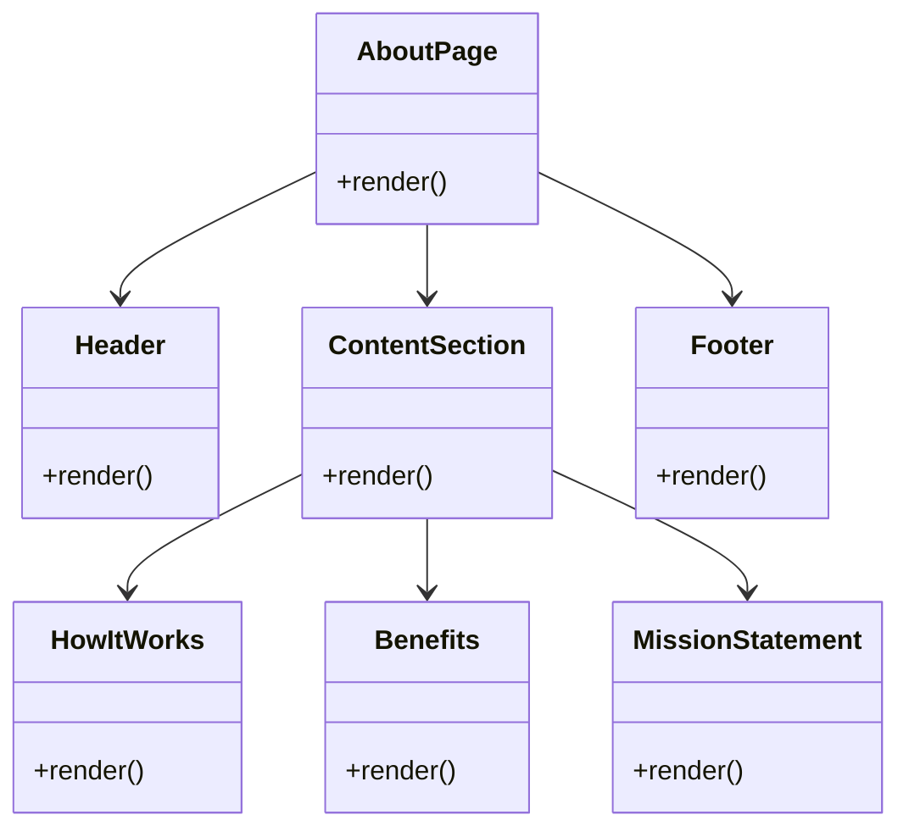
```mermaid
classDiagram
    class AboutPage {
        +render()
    }

    class Header {
        +render()
    }

    class ContentSection {
        +render()
    }

    class Footer {
        +render()
    }

    class HowItWorks {
        +render()
    }

    class Benefits {
        +render()
    }

    class MissionStatement {
        +render()
    }

    AboutPage --> Header
    AboutPage --> ContentSection
    AboutPage --> Footer
    ContentSection --> HowItWorks
    ContentSection --> Benefits
    ContentSection --> MissionStatement
```

#### Unit test description

1. Renders static content
2. Responsive behavior

### Unit 3: About Developer Page (Front End)

#### Description

Displays developer bio and contact information, possibly including GitHub or portfolio.

#### Diagrams

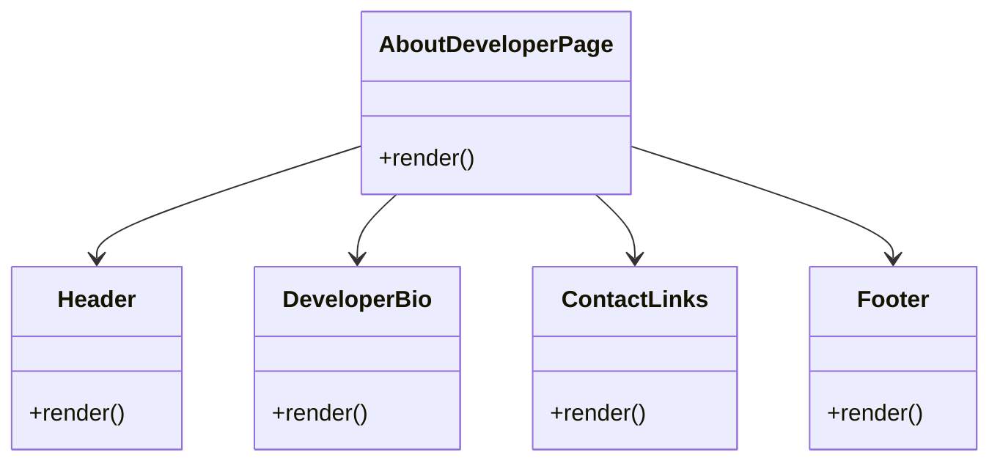
```mermaid
classDiagram
    class AboutDeveloperPage {
        +render()
    }

    class Header {
        +render()
    }

    class DeveloperBio {
        +render()
    }

    class ContactLinks {
        +render()
    }

    class Footer {
        +render()
    }

    AboutDeveloperPage --> Header
    AboutDeveloperPage --> DeveloperBio
    AboutDeveloperPage --> ContactLinks
    AboutDeveloperPage --> Footer
```

#### Unit test description

1. Component renders properly
2. Contains links to Elizabeth's github

### Unit 4: Sign Up Page (Front End)

#### Description

Allows new users to create an account.

#### Diagrams

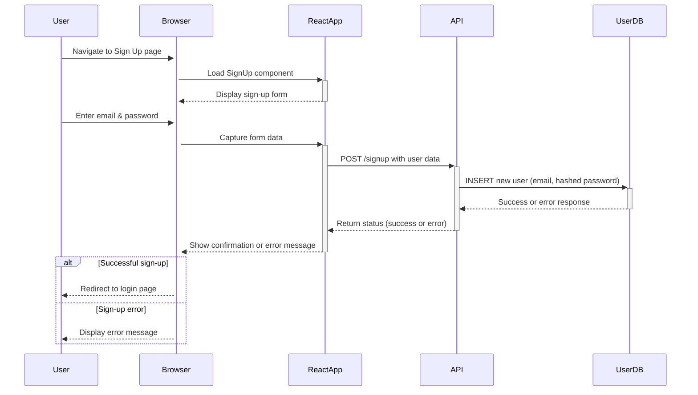
```mermaid
sequenceDiagram
    participant User
    participant Browser
    participant ReactApp
    participant API
    participant UserDB

    User->>+Browser: Navigate to Sign Up page
    Browser->>+ReactApp: Load SignUp component
    ReactApp-->>-Browser: Display sign-up form

    User->>+Browser: Enter email & password
    Browser->>+ReactApp: Capture form data
    ReactApp->>+API: POST /signup with user data
    API->>+UserDB: INSERT new user (email, hashed password)
    UserDB-->>-API: Success or error response
    API-->>-ReactApp: Return status (success or error)
    ReactApp-->>-Browser: Show confirmation or error message
    alt Successful sign-up
        Browser-->>User: Redirect to login page
    else Sign-up error
        Browser-->>User: Display error message
    end
```

#### Unit test description

1. Valid input accepted
2. Invalid input shows errors
3. Form submits to backend
4. Redirects to login

### Unit 5: Login Page (Front End)

#### Description

Authenticates returning users.

#### Diagrams

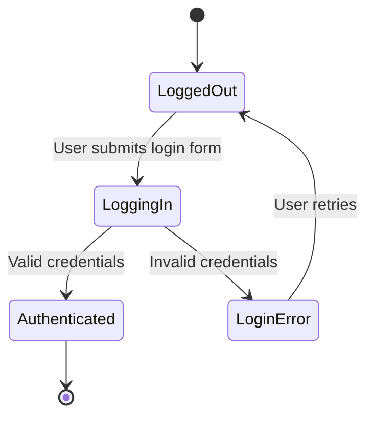
```mermaid
stateDiagram-v2
    [*] --> LoggedOut

    LoggedOut --> LoggingIn : User submits login form
    LoggingIn --> Authenticated : Valid credentials
    LoggingIn --> LoginError : Invalid credentials
    LoginError --> LoggedOut : User retries
    Authenticated --> [*]
```

#### Unit test description

1. Valid credentials accepted
2. Invalid credentials show error
3. Redirects on success

### Unit 6: User Dashboard (Front End)

#### Description

Central hub for viewing updates, saved searches, and navigating features.

#### Diagrams

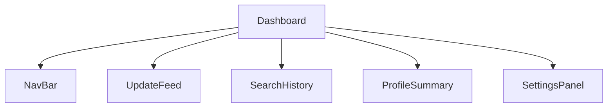
```mermaid
graph TD
  Dashboard --> NavBar
  Dashboard --> UpdateFeed
  Dashboard --> SearchHistory
  Dashboard --> ProfileSummary
  Dashboard --> SettingsPanel
```

#### Unit test description

1. Loads user-specific data
2. Interacts with update and search history components

### Unit 7: User Profile (Front End)

#### Description

Displays and allows editing of user preferences and scheduling options.

#### Diagrams

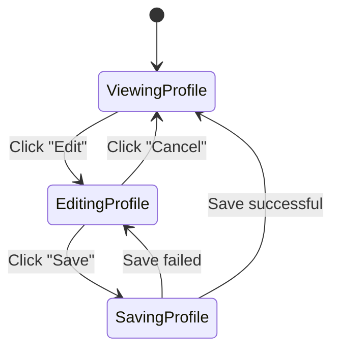
```mermaid
stateDiagram-v2
    [*] --> ViewingProfile

    ViewingProfile --> EditingProfile : Click "Edit"
    EditingProfile --> ViewingProfile : Click "Cancel"
    EditingProfile --> SavingProfile : Click "Save"
    SavingProfile --> ViewingProfile : Save successful
    SavingProfile --> EditingProfile : Save failed
```

#### Unit test description

1. Fields render properly
2. Edit mode saves to backend

### Unit 8: Search History Page (Front End)

#### Description

Lists user’s past queries and links to associated summaries. Also lists articles returned from each queries and their relevant information (authors, DOI, database). Allows past queries to be edited. 

#### Diagrams

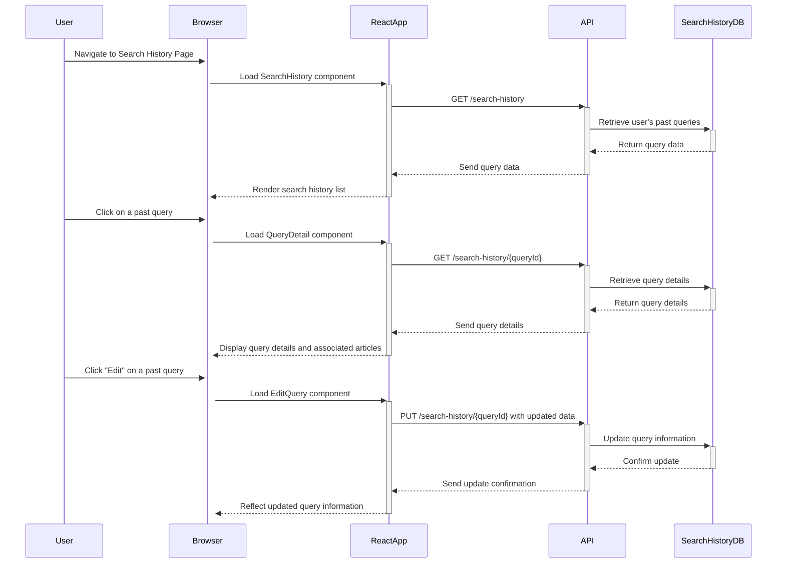
```mermaid
sequenceDiagram
    participant User
    participant Browser
    participant ReactApp
    participant API
    participant SearchHistoryDB

    User->>+Browser: Navigate to Search History Page
    Browser->>+ReactApp: Load SearchHistory component
    ReactApp->>+API: GET /search-history
    API->>+SearchHistoryDB: Retrieve user's past queries
    SearchHistoryDB-->>-API: Return query data
    API-->>-ReactApp: Send query data
    ReactApp-->>-Browser: Render search history list

    User->>+Browser: Click on a past query
    Browser->>+ReactApp: Load QueryDetail component
    ReactApp->>+API: GET /search-history/{queryId}
    API->>+SearchHistoryDB: Retrieve query details
    SearchHistoryDB-->>-API: Return query details
    API-->>-ReactApp: Send query details
    ReactApp-->>-Browser: Display query details and associated articles

    User->>+Browser: Click "Edit" on a past query
    Browser->>+ReactApp: Load EditQuery component
    ReactApp->>+API: PUT /search-history/{queryId} with updated data
    API->>+SearchHistoryDB: Update query information
    SearchHistoryDB-->>-API: Confirm update
    API-->>-ReactApp: Send update confirmation
    ReactApp-->>-Browser: Reflect updated query information
```

#### Unit test description

1. Query history renders
2. Links to past summaries work
3. Relevant article info properly displayed
4. Users can option prevoius search options

### Unit 9: New Query Page (Front End)

#### Description

Form for users to define and submit a new literature search.

#### Diagrams

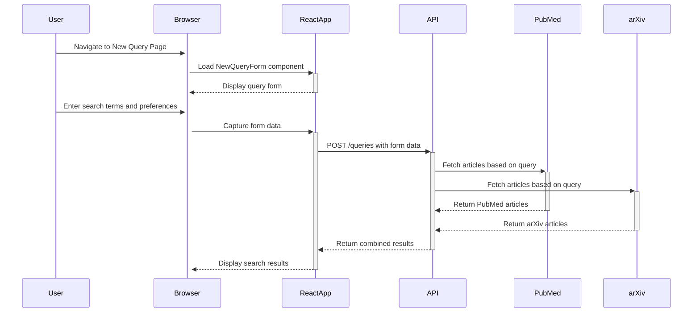
```mermaid
sequenceDiagram
    participant User
    participant Browser
    participant ReactApp
    participant API
    participant PubMed
    participant arXiv

    User->>+Browser: Navigate to New Query Page
    Browser->>+ReactApp: Load NewQueryForm component
    ReactApp-->>-Browser: Display query form

    User->>+Browser: Enter search terms and preferences
    Browser->>+ReactApp: Capture form data
    ReactApp->>+API: POST /queries with form data
    API->>+PubMed: Fetch articles based on query
    API->>+arXiv: Fetch articles based on query
    PubMed-->>-API: Return PubMed articles
    arXiv-->>-API: Return arXiv articles
    API-->>-ReactApp: Return combined results
    ReactApp-->>-Browser: Display search results
```

#### Unit test description

1. Input validation
2. Successful submission triggers backend fetch

### Unit 10: Previous Search Page (Front End)

#### Description

Shows results for a selected previous query.

#### Diagrams

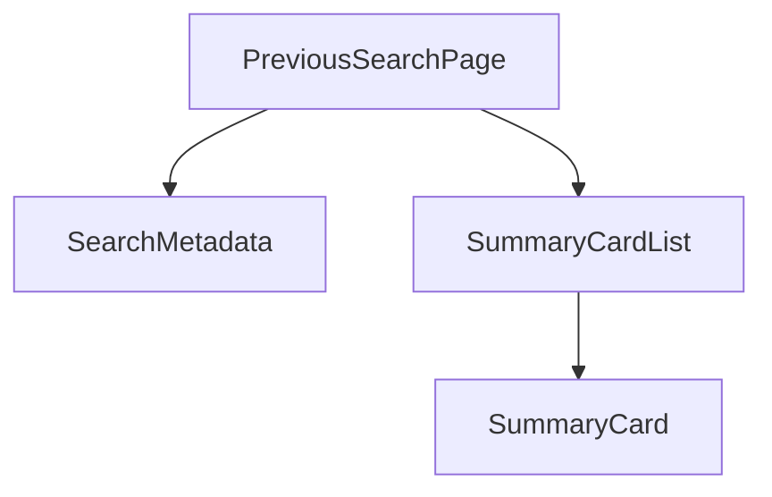
```mermaid
graph TD
  PreviousSearchPage --> SearchMetadata
  PreviousSearchPage --> SummaryCardList
  SummaryCardList --> SummaryCard
```
Component Hierarchy: Metadata + Summary Cards

#### Unit test description

1. Displays correct search results
2. Navigation back to dashboard works

### Unit 11: User Database (Backend, Databases)

#### Description

Stores user information including email, hashed password, name, phone number

#### Diagrams

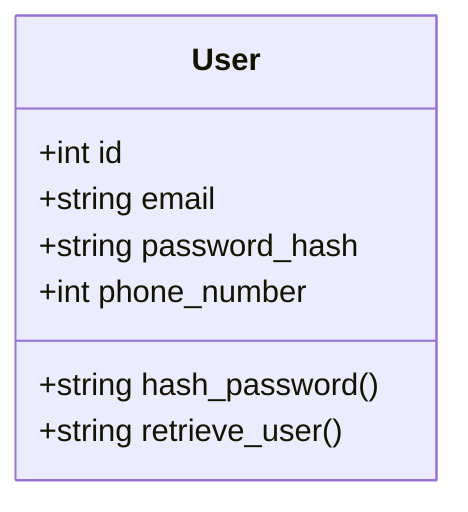
```mermaid
classDiagram
    class User {
        +int id
        +string email
        +string password_hash
        +int phone_number
        +string hash_password()
        +string retrieve_user()
    }
```
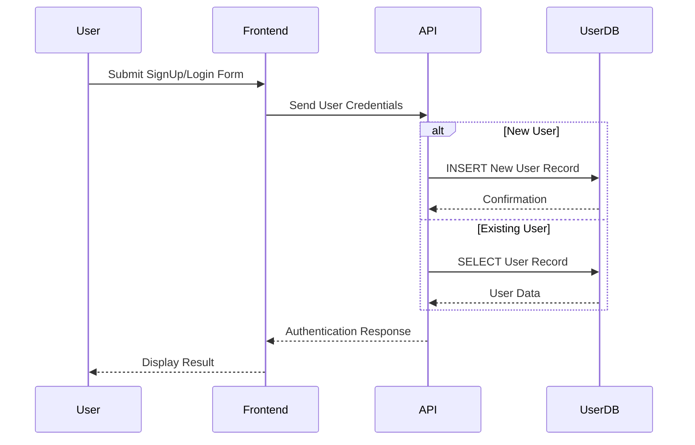
```mermaid
sequenceDiagram
    participant User
    participant Frontend
    participant API
    participant UserDB

    User->>Frontend: Submit SignUp/Login Form
    Frontend->>API: Send User Credentials
    alt New User
        API->>UserDB: INSERT New User Record
        UserDB-->>API: Confirmation
    else Existing User
        API->>UserDB: SELECT User Record
        UserDB-->>API: User Data
    end
    API-->>Frontend: Authentication Response
    Frontend-->>User: Display Result
```
#### Unit test description

2. Validate password hashing
3. Retrieve user by email

### Unit 12: User Feedback Database (Backend, Databases)

#### Description

Captures user-submitted feedback including satisfaction scores and suggestions for improvement.

#### Diagrams
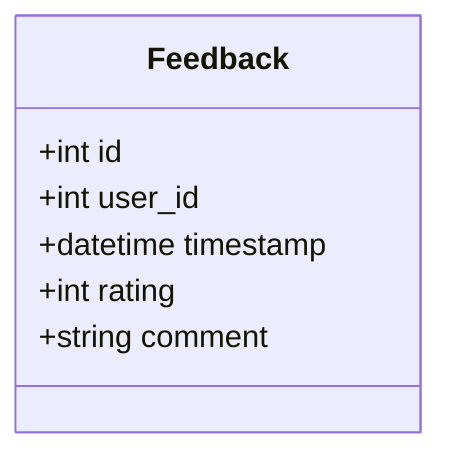
```mermaid
classDiagram
    class Feedback {
        +int id
        +int user_id
        +datetime timestamp
        +int rating
        +string comment
    }
```
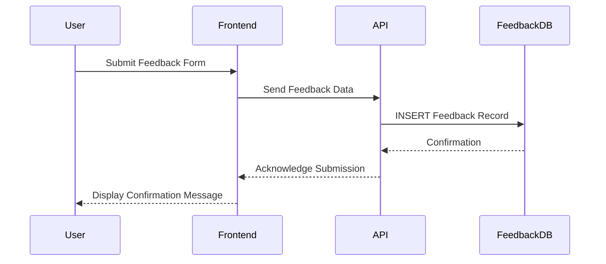
```mermaid
sequenceDiagram
    participant User
    participant Frontend
    participant API
    participant FeedbackDB

    User->>Frontend: Submit Feedback Form
    Frontend->>API: Send Feedback Data
    API->>FeedbackDB: INSERT Feedback Record
    FeedbackDB-->>API: Confirmation
    API-->>Frontend: Acknowledge Submission
    Frontend-->>User: Display Confirmation Message
```

#### Unit test description

1. Add valid feedback
2. Enforce required fields
3. Retrieve feedback by user/date

### Unit 13: Search History Database (Backend, Databases)

#### Description

Logs all search queries made by a user, along with metadata and result summaries.

#### Diagrams

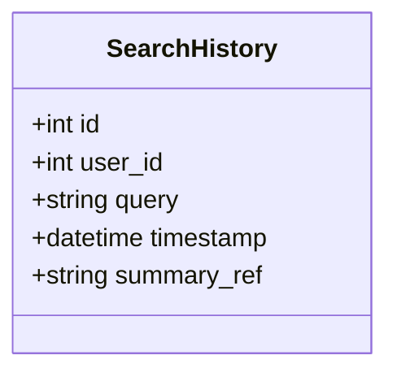
```mermaid
classDiagram
    class SearchHistory {
        +int id
        +int user_id
        +string query
        +datetime timestamp
        +string summary_ref
    }
```
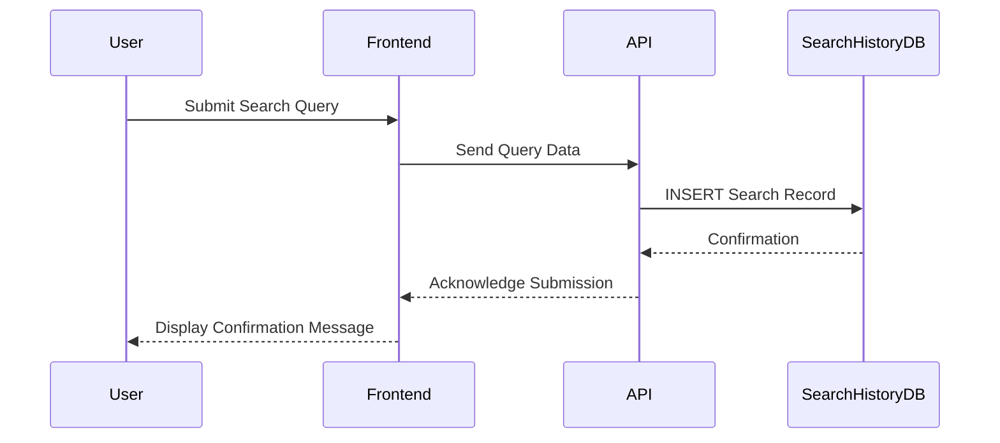
```mermaid
sequenceDiagram
    participant User
    participant Frontend
    participant API
    participant SearchHistoryDB

    User->>Frontend: Submit Search Query
    Frontend->>API: Send Query Data
    API->>SearchHistoryDB: INSERT Search Record
    SearchHistoryDB-->>API: Confirmation
    API-->>Frontend: Acknowledge Submission
    Frontend-->>User: Display Confirmation Message
```

#### Unit test description

1. Insert search history
2. Retrieve history by user
3. Delete/clean up old history entries

### Unit 14: Scheduler Database (Backend, Databases)

#### Description

Manages scheduling preferences for article updates (e.g., frequency, next update time).

#### Diagrams

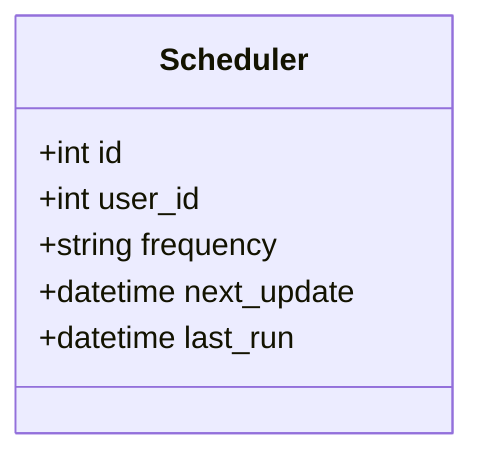
```mermaid
classDiagram
    class Scheduler {
        +int id
        +int user_id
        +string frequency
        +datetime next_update
        +datetime last_run
    }
```
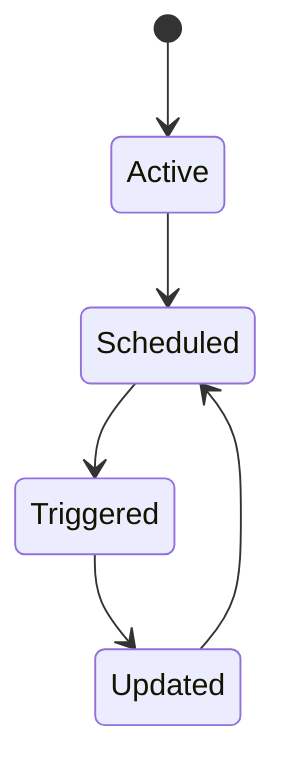
```mermaid
stateDiagram-v2
    [*] --> Active
    Active --> Scheduled
    Scheduled --> Triggered
    Triggered --> Updated
    Updated --> Scheduled
```

#### Unit test description

1. Add/update scheduler entry
2. Compute next run time
3. Fetch scheduler job by user ID

### Unit 15: Dashboard Interactivity (Backend, User Workflow)

#### Description

Handles user input on dashboard (e.g., feedback on articles, bookmarking, editing settings).

#### Diagrams

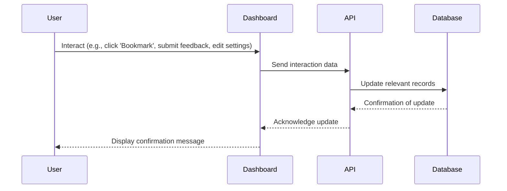
```mermaid
sequenceDiagram
    participant User
    participant Dashboard
    participant API
    participant Database

    User->>Dashboard: Interact (e.g., click 'Bookmark', submit feedback, edit settings)
    Dashboard->>API: Send interaction data
    API->>Database: Update relevant records
    Database-->>API: Confirmation of update
    API-->>Dashboard: Acknowledge update
    Dashboard-->>User: Display confirmation message
```

#### Unit test description

1. Save feedback from dashboard
2. Access search history
4. Edit search preferences

### Unit 16: Dashboard Display (Backend, User Workflow)

#### Description

Populates the frontend dashboard with user-specific update summaries and profile data.

#### Diagrams

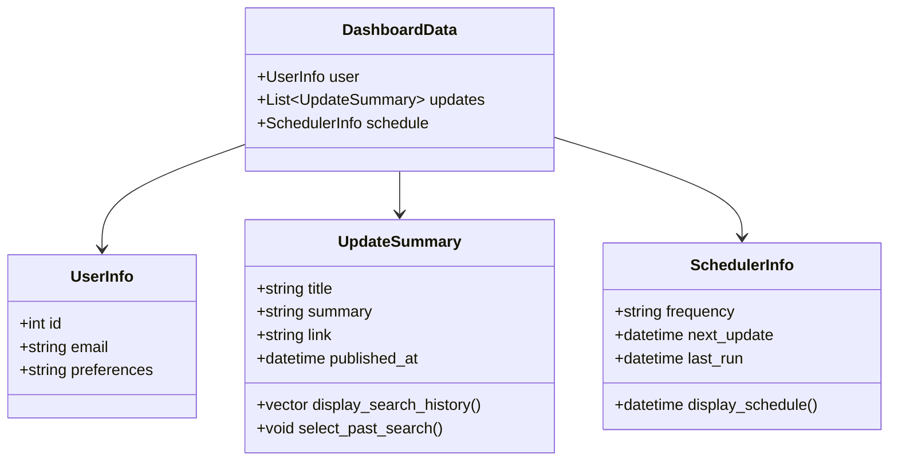
```mermaid
classDiagram
    class DashboardData {
        +UserInfo user
        +List~UpdateSummary~ updates
        +SchedulerInfo schedule
    }

    class UserInfo {
        +int id
        +string email
        +string preferences
    }

    class UpdateSummary {
        +string title
        +string summary
        +string link
        +datetime published_at
        +vector display_search_history()
        +void select_past_search()
    }

    class SchedulerInfo {
        +string frequency
        +datetime next_update
        +datetime last_run
        +datetime display_schedule()
    }

    DashboardData --> UserInfo
    DashboardData --> UpdateSummary
    DashboardData --> SchedulerInfo
```
```mermaid
sequenceDiagram
    participant User
    participant Frontend
    participant API
    participant UserDB
    participant SearchHistoryDB
    participant SchedulerDB

    User->>Frontend: Access Dashboard
    Frontend->>API: Request Dashboard Data
    API->>UserDB: Fetch UserInfo
    API->>SearchHistoryDB: Fetch UpdateSummaries
    API->>SchedulerDB: Fetch SchedulerInfo
    API-->>Frontend: Return DashboardData
    Frontend-->>User: Display Dashboard

```

#### Unit test description

1. Correct data shown for each user
2. Returns recent updates only
3. Handles edge cases (no updates, missing profile)

### Unit 17: User Login (Backend, User Workflow)

#### Description

Authenticates users using their credentials and manages session tokens.

#### Diagrams

```mermaid
sequenceDiagram
    participant User
    participant Frontend
    participant AuthService
    participant UserDB
    participant TokenService

    User->>Frontend: Enter credentials
    Frontend->>AuthService: Send login request
    AuthService->>UserDB: Verify credentials
    UserDB-->>AuthService: Return user data
    AuthService->>TokenService: Generate session token
    TokenService-->>AuthService: Return token
    AuthService-->>Frontend: Return token
    Frontend-->>User: Grant access
```
```mermaid
stateDiagram-v2
    [*] --> LoggedOut
    LoggedOut --> AuthValidating : Submit credentials
    AuthValidating --> LoggedIn : Success
    AuthValidating --> LoggedOut : Failure
    LoggedIn --> LoggedOut : Logout
```

#### Unit test description

1. Correct login with valid credentials
2. Deny access with invalid credentials
3. Token returned and stored securely

### Unit 18: User Sign Up (Backend, User Workflow)

#### Description

Registers new users and inserts their credentials and preferences into the system.

#### Diagrams

```mermaid
sequenceDiagram
    participant User
    participant Frontend
    participant API
    participant UserDB

    User->>Frontend: Fill and submit sign-up form
    Frontend->>API: Send sign-up data
    API->>UserDB: Check if email exists
    alt Email exists
        API-->>Frontend: Return error (Email already in use)
        Frontend-->>User: Display error message
    else Email does not exist
        API->>API: Validate input fields
        API->>API: Hash password
        API->>UserDB: Insert new user record
        UserDB-->>API: Confirm insertion
        API-->>Frontend: Return success response
        Frontend-->>User: Display success message
    end
```
Sequence Diagram: Form Submit -> API -> User DB (INSERT)

#### Unit test description

1. Validate all required fields
2. Ensure email uniqueness
3. Verify email
4. Store encrypted password

### Unit 19: New Query (Backend, User Workflow)

#### Description

Takes new search queries, calls literature APIs, stores query, and returns results.

#### Diagrams

```mermaid
sequenceDiagram
    participant User
    participant Frontend
    participant API
    participant PubMed
    participant arXiv
    participant SummaryService
    participant SearchHistoryDB

    User->>Frontend: Submit search query
    Frontend->>API: Send query data
    API->>PubMed: Request articles
    API->>arXiv: Request articles
    PubMed-->>API: Return articles
    arXiv-->>API: Return articles
    API->>SummaryService: Generate summaries
    SummaryService-->>API: Return summaries
    API->>SearchHistoryDB: Store query and metadata
    API-->>Frontend: Return articles and summaries
    Frontend-->>User: Display results
```

#### Unit test description

1. Store query string
2. Return articles from API
3. Store metadata and summary reference

### Unit 20: User Profile (Backend, User Workflow)

#### Description

Manages user profile updates such as preferred fields, summary frequency, and contact info.

#### Diagrams

```mermaid
classDiagram
    class Profile {
        +int id
        +int user_id
        +List~String~ fields_of_interest
        +String schedule
    }
```
```mermaid
sequenceDiagram
    participant User
    participant Frontend
    participant API
    participant UserProfileDB

    User->>Frontend: View/Edit Profile
    Frontend->>API: Send profile request
    API->>UserProfileDB: SELECT/UPDATE profile data
    UserProfileDB-->>API: Return confirmation/data
    API-->>Frontend: Return response
    Frontend-->>User: Display updated profile
```

#### Unit test description

1. Profile loads with correct data
2. Update preferences saved
3. Missing fields show default values

### Unit 21: Search History (Backend, User Workflow)

#### Description

Retrieves a user's previous queries and associated metadata for display and re-use.

#### Diagrams

```mermaid
sequenceDiagram
    participant User
    participant Frontend
    participant API
    participant SearchHistoryDB

    User->>Frontend: Request search history
    Frontend->>API: Fetch search history
    API->>SearchHistoryDB: SELECT queries WHERE user_id = current_user ORDER BY timestamp DESC
    SearchHistoryDB-->>API: Return query list
    API-->>Frontend: Return search history data
    Frontend-->>User: Display past queries
```

#### Unit test description

1. Fetch history by user
2. Return most recent searches first
3. Handle empty history case

### Unit 22: User Feedback (Backend, User Workflow)

#### Description

Collects and processes user feedback submitted through the interface.

#### Diagrams

```mermaid
sequenceDiagram
    participant User
    participant Frontend
    participant API
    participant FeedbackDB

    User->>Frontend: Submit feedback form
    Frontend->>API: Send feedback data
    API->>FeedbackDB: INSERT feedback (user_id, timestamp, rating, comment)
    FeedbackDB-->>API: Acknowledge insertion
    API-->>Frontend: Confirm feedback submission
    Frontend-->>User: Display confirmation message
```

#### Unit test description

1. Accept valid feedback
2. Reject malformed feedback
3. Store metadata (timestamp, user ID)
   
### Unit 23: Update Notifications (Backend, Messaging)

#### Description

Sends update summaries via email or in-app notifications based on user schedules.

#### Diagrams

```mermaid
sequenceDiagram
    participant CronJob
    participant SchedulerDB
    participant UpdateService
    participant NotificationService
    participant User

    CronJob->>SchedulerDB: Fetch due schedules
    SchedulerDB-->>CronJob: Return user schedules
    CronJob->>UpdateService: Generate updates
    UpdateService->>NotificationService: Send notifications
    NotificationService->>User: Deliver update (email/SMS)
    NotificationService->>SchedulerDB: Log notification status
```
```mermaid
stateDiagram-v2
    [*] --> Scheduled
    Scheduled --> Triggered : Time reached
    Triggered --> Sent : Notification dispatched
    Sent --> [*]
```

#### Unit test description

1. Triggered on schedule
2. Sends correct content
3. Logs notification status

### Unit 24: PubMed API (Backend, API)

#### Description

Connects to PubMed to retrieve articles based on user-defined queries.

#### Diagrams

```mermaid
sequenceDiagram
    participant User
    participant Frontend
    participant APIWrapper
    participant PubMed

    User->>Frontend: Submit search query
    Frontend->>PubMedEUtilitiesAPIWrapper: Send query parameters
    PubMedEUtilitiesAPIWrapper->>PubMed: Request articles
    PubMed-->PubMedEUtilitiesAPIWrapper: Return article metadata
    PubMedEUtilitiesAPIWrapper-->>Frontend: Deliver metadata
    Frontend-->>User: Display search results
```

#### Unit test description

1. Alternate queries execute correctly
2. Error fallback works
3. Metadata returned is accurate

### Unit 25: arXIV API (Backend, API)

#### Description

Interfaces with arXiv to retrieve relevant preprints matching user queries.

#### Diagrams

```mermaid
sequenceDiagram
    participant User
    participant Frontend
    participant arXivWrapper
    participant arXiv

    User->>Frontend: Submit search query
    Frontend->>arXivAPIWrapper: Send query parameters
    arXivAPIWrapper->>arXiv: Request preprints
    arXiv-->>arXivAPIWrapper: Return XML response
    arXivAPIWrapper-->>Frontend: Deliver parsed metadata
    Frontend-->>User: Display search results
```

#### Unit test description

1. Generate valid query syntax
2. Parse arXiv XML responses
3. Handle missing or malformed data

### Unit 26: Article Selection & Summarization (Backend, API/AI/Messaging)

#### Description

Filters retrieved articles and generates concise, readable AI summaries for each.

#### Diagrams

```mermaid
sequenceDiagram
    participant API
    participant Summarizer
    participant AIModel

    API->>Summarizer: Receive article metadata
    Summarizer->>AIModel: Send article content
    AIModel-->>Summarizer: Return summary and key points
    Summarizer-->>API: Deliver summarized articles
```
```mermaid
stateDiagram-v2
    [*] --> RawArticle
    RawArticle --> Selected : Meets relevance criteria
    Selected --> Summarized : Processed by AI summarizer
    Summarized --> [*]
```

#### Unit test description

1. Selects top articles per user/topic
2. Summaries under word limit
3. Validate NLP pipeline outputs

### Unit 27: Search Query Optomization (Backend, AI Integration)

#### Description

Improves user queries via NLP techniques to enhance article retrieval relevance.

#### Diagrams

```mermaid
classDiagram
    class QueryOptimizer {
        +optimizeQuery(query: String): String
    }

    class InputAnalyzer {
        +analyze(query: String): List~String~
    }

    class SynonymExpander {
        +expand(terms: List~String~): List~String~
    }

    QueryOptimizer --> InputAnalyzer
    QueryOptimizer --> SynonymExpander
```
```mermaid
sequenceDiagram
    participant User
    participant Frontend
    participant API
    participant QueryOptimizer
    participant PubMed
    participant arXiv

    User->>Frontend: Enter search query
    Frontend->>API: Submit query
    API->>QueryOptimizer: Optimize query
    QueryOptimizer->>API: Return optimized query
    API->>PubMed: Query with optimized terms
    API->>arXiv: Query with optimized terms
    PubMed-->>API: Return articles
    arXiv-->>API: Return articles
    API-->>Frontend: Deliver search results
    Frontend-->>User: Display articles
```
Class Diagram: QueryOptimizer(InputAnalyzer, SynonymExpander)
Sequence Diagram: User Query -> Optimizer -> PubMed/arXiv

#### Unit test description

1. Outputs improved queries
2. Handles edge cases (stop words, short queries)
3. Boosts match rate in test cases

### Unit 28: Update Formatting (Backend, Messaging)

#### Description

Converts selected articles and summaries into a user-friendly update message format (HTML/email/in-app).

#### Diagrams

```mermaid
classDiagram
    class UpdateFormatter {
        +formatUpdate(summaries: List~Summary~): String
    }

    class TemplateEngine {
        +render(template: String, data: Map): String
    }

    class MarkdownRenderer {
        +toHTML(markdown: String): String
    }

    UpdateFormatter --> TemplateEngine
    UpdateFormatter --> MarkdownRenderer
```
```mermaid
sequenceDiagram
    participant Summarizer
    participant UpdateFormatter
    participant TemplateEngine
    participant MarkdownRenderer
    participant NotificationService

    Summarizer->>UpdateFormatter: Provide article summaries
    UpdateFormatter->>MarkdownRenderer: Convert summaries to HTML
    MarkdownRenderer-->>UpdateFormatter: Return HTML content
    UpdateFormatter->>TemplateEngine: Apply template to HTML content
    TemplateEngine-->>UpdateFormatter: Return formatted message
    UpdateFormatter->>NotificationService: Send formatted update
```

#### Unit test description

1. Format summary blocks cleanly
2. Escape special characters
3. Include links and metadata

### Unit 29: Admin Capabilities (Backend)

#### Description

Provides admin-level tools for managing users, monitoring system usage, and updating content settings.

#### Diagrams

```mermaid
classDiagram
    class AdminTools {
        +UserManager userManager
        +FeedbackReview feedbackReview
        +SchedulerOverride schedulerOverride
    }

    class UserManager {
        +banUser(userId: int): void
        +deleteUser(userId: int): void
        +viewUserLogs(userId: int): Log[]
    }

    class FeedbackReview {
        +reviewFeedback(feedbackId: int): Feedback
        +deleteFeedback(feedbackId: int): void
    }

    class SchedulerOverride {
        +rescheduleUser(userId: int, newSchedule: Schedule): void
        +overrideSchedule(userId: int): void
    }

    AdminTools --> UserManager
    AdminTools --> FeedbackReview
    AdminTools --> SchedulerOverride
```
```mermaid
stateDiagram-v2
    [*] --> View
    View --> SelectUser
    SelectUser --> BanUser : Ban action
    SelectUser --> Reschedule : Reschedule action
    SelectUser --> DeleteUser : Delete action
    BanUser --> [*]
    Reschedule --> [*]
    DeleteUser --> [*]
```

#### Unit test description

1. Admin actions authorized only
2. Retrieve user/search logs
3. Modify schedules or purge data

### Unit 30: Access Information from Scheduler Database (Backend, Databases)

#### Description

Fetches user-specific scheduling data for determining when to send update notifications.

#### Diagrams

```mermaid
sequenceDiagram
    participant SchedulerService
    participant SchedulerDB

    SchedulerService->>SchedulerDB: Query schedule by user ID
    SchedulerDB-->>SchedulerService: Return frequency and next update time
```

#### Unit test description

1. Query scheduler info by user ID
2. Handle missing or invalid IDs
3. Confirm correct data formatting

### Unit 31: Access Information from User Database (Backend, Databases)

#### Description

Retrieves user metadata such as preferences, contact info, and login credentials.

#### Diagrams

```mermaid
sequenceDiagram
    participant Frontend
    participant API
    participant UserDB

    Frontend->>API: Request user data (login/profile)
    API->>UserDB: SELECT * FROM users WHERE id/email = ?
    UserDB-->>API: Return user record
    API-->>Frontend: Return user metadata (masked as needed)
```

#### Unit test description

1. Return correct user on query
2. Handle non-existent user
3. Mask sensitive fields where necessary

### Unit 32: Access Information from Search History Database (Backend, Databases)

#### Description

Allows retrieval of all prior user search queries, useful for both frontend display and backend analytics.

#### Diagrams

```mermaid
sequenceDiagram
    participant Frontend
    participant API
    participant SearchHistoryDB

    Frontend->>API: Request search history for user
    API->>SearchHistoryDB: SELECT * FROM search_history WHERE user_id = ?
    SearchHistoryDB-->>API: Return list of past queries
    API-->>Frontend: Deliver search history data
```

#### Unit test description

1. Fetch history by user
2. Handle no-history case
3. Ensure time-based ordering

### Unit 33: Access Information from Feedback Database (Backend, Databases)

#### Description

Retrieves user-submitted feedback for AI optimization of article summarization and relevance + search strategy improvement

#### Diagrams

```mermaid
sequenceDiagram
    participant OptimizationRequest
    participant API
    participant FeedbackDB

    OptimizationRequest->>API: Request feedback records
    API->>FeedbackDB: SELECT * FROM feedback WHERE filters
    FeedbackDB-->>API: Return feedback entries
    API-->>OptimizationRequest: Deliver feedback data

```

#### Unit test description

1. Pull feedback entries

### Unit 34: Update information from scheduler database (Backend, Databases)

#### Description

Updates existing scheduler entries, e.g., modifying frequency or resetting timers after an update.

#### Diagrams

```mermaid
sequenceDiagram
    participant CronJob
    participant SchedulerService
    participant SchedulerDB

    CronJob->>SchedulerService: Trigger update event
    SchedulerService->>SchedulerDB: UPDATE scheduler SET frequency = ?, next_update = ? WHERE id = ?
    SchedulerDB-->>SchedulerService: Acknowledge update
    SchedulerService-->>CronJob: Confirm update completed
```

#### Unit test description

1. Update by scheduler ID
2. Ensure data integrity (valid frequencies only)
3. Handle concurrent updates

### Unit 35: update information from user database (Backend, Databases)

#### Description

Applies edits to user profiles such as preferences, scheduling frequency, or contact details.

#### Diagrams

```mermaid
sequenceDiagram
    participant Frontend
    participant API
    participant UserDB

    Frontend->>API: Submit updated profile data
    API->>UserDB: UPDATE users SET preferences = ?, contact_info = ? WHERE id = ?
    UserDB-->>API: Acknowledge update
    API-->>Frontend: Confirm update success
```

#### Unit test description

1. Validate input before update
2. Update only allowed fields

### Unit 36: Update information from search history database (Backend, Databases)

#### Description

Enables adding metadata or tagging previous search history entries post-query (e.g., adding relevance scores).

#### Diagrams

```mermaid
sequenceDiagram
    participant ScoringJob
    participant API
    participant SearchHistoryDB

    ScoringJob->>API: Submit relevance scores and query metadata
    API->>SearchHistoryDB: UPDATE search_history SET metadata = ? WHERE id = ?
    SearchHistoryDB-->>API: Confirm update success
    API-->>ScoringJob: Acknowledge update completion
```

#### Unit test description

1. Update correct entry by ID
2. Reject invalid metadata formats
3. Ensure history record integrity

### Unit 37: Update information from feedback database (Backend, Databases)

#### Description

Users can provide feedback on the accuracy and relevance of search results and AI-generated summaries. The system leverages this feedback to refine future search strategies and improve article summarization.

#### Diagrams

```mermaid
sequenceDiagram
    participant User
    participant Frontend
    participant API
    participant FeedbackDB
    participant AdminPanel
    participant SearchOptimizer

    User->>Frontend: Submit feedback
    Frontend->>API: Send feedback data
    API->>FeedbackDB: INSERT feedback entry
    FeedbackDB-->>API: Confirm insertion
    API-->>Frontend: Acknowledge submission

    AdminPanel->>API: Retrieve feedback for review
    API->>FeedbackDB: SELECT feedback entries
    FeedbackDB-->>API: Return feedback data
    API-->>AdminPanel: Deliver feedback entries

    AdminPanel->>API: Update feedback status/admin notes
    API->>FeedbackDB: UPDATE feedback entry
    FeedbackDB-->>API: Confirm update

    API->>SearchOptimizer: Send feedback data
    SearchOptimizer-->>API: Confirm integration
```

#### Unit test description

1. Modify feedback metadata (e.g., status)
2. Verify only authorized users can modify feedback
4. Feedback integration functions as expected
   
### Unit 38: Encryt password (Backend, Databases)

#### Description

Hashes user passwords before storing them in the database to ensure secure authentication.

#### Diagrams

```mermaid
classDiagram
    class User {
        +int id
        +string email
        -string password_hash
        +register(email: string, password: string)
        +authenticate(password: string): bool
    }

    class PasswordHasher {
        +string hash(password: string)
        +bool verify(password: string, hash: string)
    }

    User --> PasswordHasher : uses
```
```mermaid
sequenceDiagram
    participant User
    participant Frontend
    participant API
    participant HashFunction
    participant UserDB

    User->>Frontend: Enter email and password
    Frontend->>API: Submit registration data
    API->>HashFunction: Hash password
    HashFunction-->>API: Return hashed password
    API->>UserDB: INSERT user with hashed password
    UserDB-->>API: Confirm insertion
    API-->>Frontend: Registration successful

    User->>Frontend: Enter email and password
    Frontend->>API: Submit login data
    API->>UserDB: Retrieve stored hashed password
    UserDB-->>API: Return hashed password
    API->>HashFunction: Verify password
    HashFunction-->>API: Verification result
    API-->>Frontend: Login success or failure
```

#### Unit test description

1. Hashing function applied correctly
2. Ensure hash is not reversible
3. Compare hashed values during login

### Unit 39: Create new scheduler item (Backend, Databases)

#### Description

Creates a new entry in the scheduler database when a user adds a new search query or modifies a search query. 

#### Diagrams

```mermaid
sequenceDiagram
    participant User
    participant Frontend
    participant API
    participant SchedulerDB

    User->>Frontend: Submit new or updated search query
    Frontend->>API: Send query data with scheduling preferences
    API->>SchedulerDB: Check for existing scheduler entry
    alt Existing scheduler entry found
        API->>SchedulerDB: DELETE existing scheduler entry
    end
    API->>SchedulerDB: INSERT new scheduler item
    SchedulerDB-->>API: Confirm insertion
    API-->>Frontend: Return success message
    Frontend-->>User: Display confirmation
```

#### Unit test description

1. Accept valid input for frequency/time
2. Validate scheduler entry format
3. Reject duplicates or conflicting entries
4. If existing search updated, scheduler deletes previous entry

### Unit 40: Create new user (Backend, Databases)

#### Description

Handles the creation of a new user account in the database during the signup process, storing all necessary information such as email, hashed password, and preferences.

#### Diagrams

```mermaid
sequenceDiagram
    participant User
    participant Frontend
    participant API
    participant HashFunction
    participant UserDB

    User->>Frontend: Submit signup form (email, password, preferences)
    Frontend->>API: Send signup data
    API->>HashFunction: Hash password
    HashFunction-->>API: Return hashed password
    API->>UserDB: INSERT new user (email, hashed password, preferences, created_at)
    UserDB-->>API: Confirm insertion
    API-->>Frontend: Return success message
    Frontend-->>User: Display account creation confirmation
```

#### Unit test description

1. Accept valid new user data
2. Hash password before insert
3. Enforce email uniqueness
4. Reject incomplete/malformed entries
   
### Unit 41: Create new search history item (Backend, Databases)

#### Description

Creates a new record in the search history database each time a user submits a new query, including timestamp and query metadata.

#### Diagrams

```mermaid
sequenceDiagram
    participant Scheduler
    participant API
    participant SearchHistoryDB

    Scheduler->>API: Trigger update for user
    API->>SearchHistoryDB: INSERT new search history entry
    SearchHistoryDB-->>API: Confirm insertion
```

#### Unit test description

1. Insert new search entry with valid data
2. Confirm association with correct user ID
3. Handle optional fields (e.g., result references)
4. Timestamp generation and format checks

### Unit 42: Create new feedback item (Backend, Databases)

#### Description

Inserts new user feedback (comments, ratings) into feedback database for future analysis and improvements.

#### Diagrams

```mermaid
sequenceDiagram
    participant User
    participant Frontend
    participant API
    participant FeedbackDB

    User->>Frontend: Submit feedback (comment, rating)
    Frontend->>API: Send feedback data
    API->>FeedbackDB: INSERT new feedback entry
    FeedbackDB-->>API: Confirm insertion
    API-->>Frontend: Return success message
    Frontend-->>User: Display confirmation
```

#### Unit test description

1. Valid feedback is added
2. Invalid feedback triggers error
3. Required fields enforced

# Integration tests

_List the integration tests for the system._

# Resources

Some useful resources:

* [Software engineering : a practitioner's approach by Roger Pressman](https://search.lib.uiowa.edu/permalink/f/9i2ftm/01IOWA_ALMA21322763270002771)
* [GUI Diagraming tool](https://app.diagrams.net/)
* [Plain text diagraming tool](https://mermaid.js.org/config/Tutorials.html)
* [Another plain text diagraming tool](https://plantuml.com/)
---

# Mermaid examples
```mermaid
gitGraph
    commit
    commit
    branch develop
    checkout develop
    commit
    commit
    checkout main
    merge develop
    commit
    commit
```
---
```mermaid
flowchart TD
    A[Christmas] -->|Get money| B(Go shopping)
    B --> C{Let me think}
    C -->|One| D[Laptop]
    C -->|Two| E[iPhone]
    C -->|Three| F[fa:fa-car Car]
```
---
```mermaid
classDiagram
    Animal <|-- Duck
    Animal <|-- Fish
    Animal <|-- Zebra
    Animal : +int age
    Animal : +String gender
    Animal: +isMammal()
    Animal: +mate()
    class Duck{
      +String beakColor
      +swim()
      +quack()
    }
    class Fish{
      -int sizeInFeet
      -canEat()
    }
    class Zebra{
      +bool is_wild
      +run()
    }
```
---
```mermaid
sequenceDiagram
    Alice->>+John: Hello John, how are you?
    Alice->>+John: John, can you hear me?
    John-->>-Alice: Hi Alice, I can hear you!
    John-->>-Alice: I feel great!
```
---
# PlantUML

```plantuml
@startuml
left to right direction
actor Guest as g
package Professional {
  actor Chef as c
  actor "Food Critic" as fc
}
package Restaurant {
  usecase "Eat Food" as UC1
  usecase "Pay for Food" as UC2
  usecase "Drink" as UC3
  usecase "Review" as UC4
}
fc --> UC4
g --> UC1
g --> UC2
g --> UC3
@enduml


```
