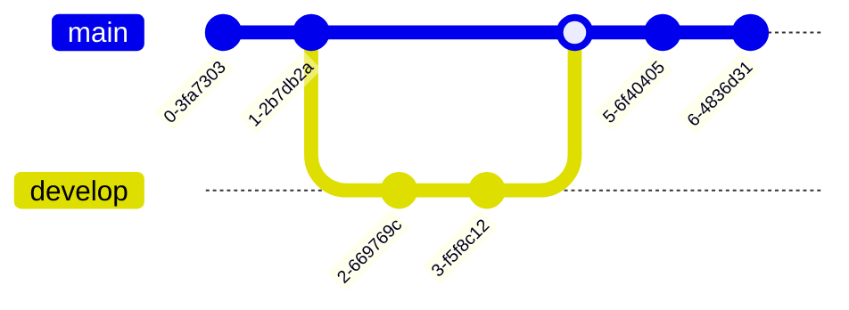
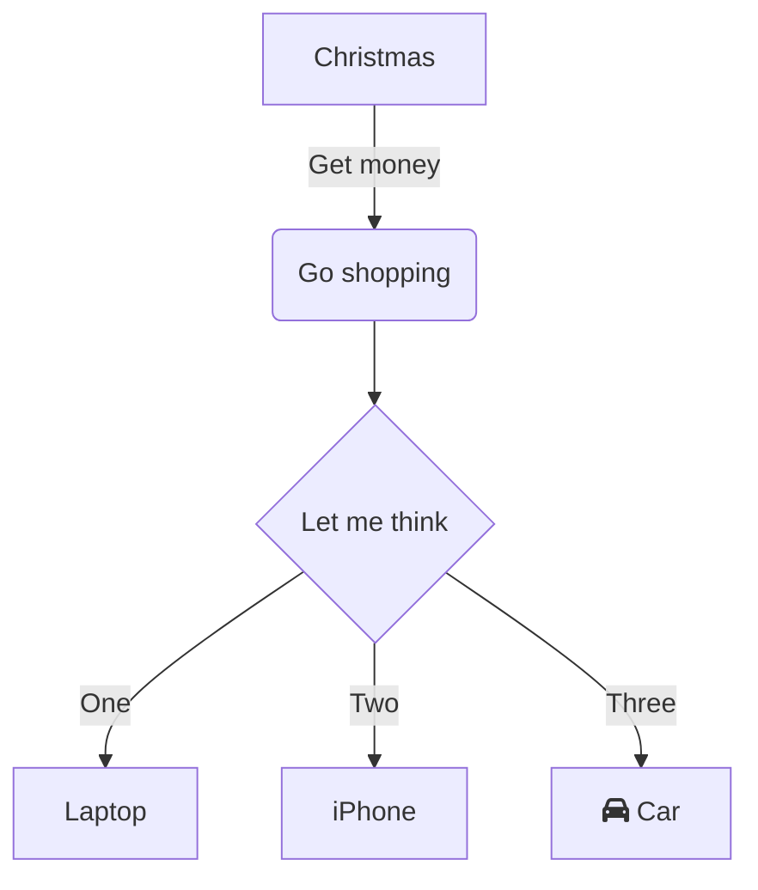
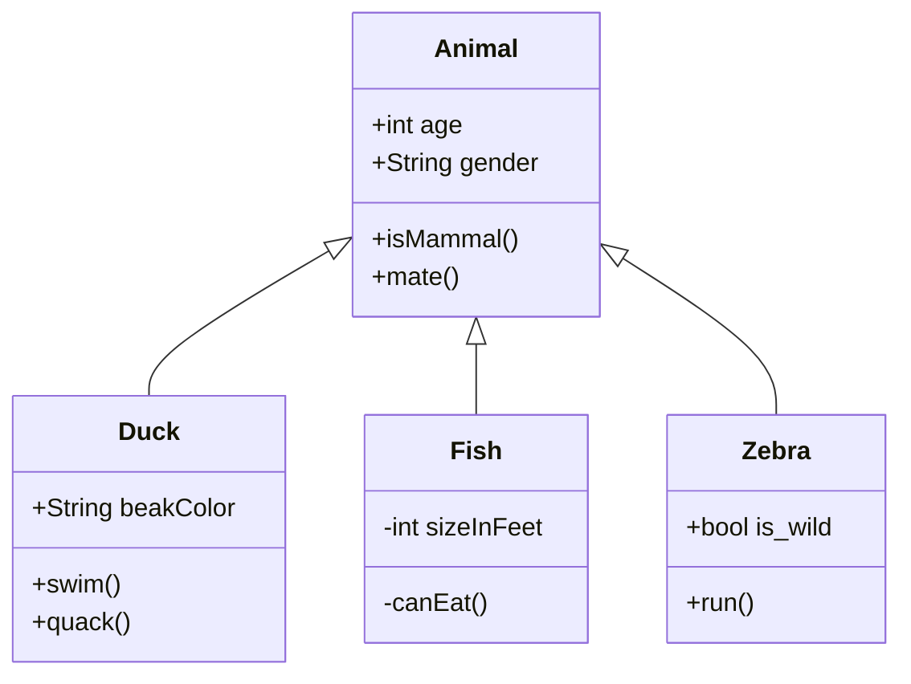
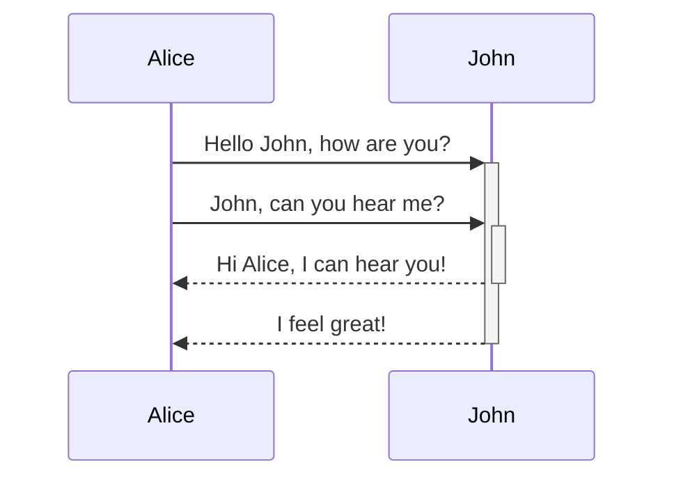
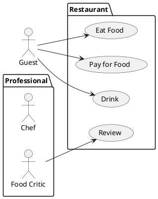

# PaperScout.ai

Design a web application which updates users daily/weekly with a specified number of recently published literature in their fields and provide AI-generated summaries of each article. 

Secondary Project Goals: Provide features to teach young researchers about literature search strategies and provide an option to see the search strategy used for each update.

# Planning

## License
    PaperScout.ai
    Copyright (C) 2025  Elizabeth Elias

    This program is free software: you can redistribute it and/or modify
    it under the terms of the GNU Affero General Public License as
    published by the Free Software Foundation, either version 3 of the
    License, or (at your option) any later version.

    This program is distributed in the hope that it will be useful,
    but WITHOUT ANY WARRANTY; without even the implied warranty of
    MERCHANTABILITY or FITNESS FOR A PARTICULAR PURPOSE.  See the
    GNU Affero General Public License for more details.

    You should have received a copy of the GNU Affero General Public License
    along with this program.  If not, see <https://www.gnu.org/licenses/>.

## Tasks

All work is to be completed by Elizabeth Elias. 

## Version control

_Describe a version control strategy. Will you branch? Will you rebase? How many branches will you maintain? How will versions be labeled?_

## Project Structure

_Describe the file/directory structure of the project_
**No directory or file shall contain: ' ' or a capital letter.**
**- source: contains all source code for the project. Each unit in it's own directory**
**- test: contains all the test code for the project. **
**- test/unit_test: contains all the unit test code for the project. Each unit in it's own directory**
**- test/integration_test: contains all the integration test code for the project. Each test in it's own directory**

## Define a unit

A unit for this project depends on the which category it falls into. 

The categories for this project are as follows: Front End, AI Integration, Messaging, Back End, and database. 

A unit for a Front End component would be considered a page on the website. For example, the sign-up page, user dashboard, and landing pages would each be considered an individual component which includes their UI design and final code using CSS / React. 

A units for the AI, messaging, and database components will be considered a function. Because these categories will likely require a lot of fine tuning and specific steps to ensure that the website can function properly, using the most granular unit is important. The AI features are beneficial to users and adjust correctly, each function should be tested independently and all units will need to be integrated precisely. The messaging component will be handling sensitive user information so the smallest unit should be tested to ensure safety of user information and ensure that updates to users are provided as expected and do not add to any confusion young researchers may face when entering their research fields. The database component not only needs to ensure that databases can be accessed and updated correctly, but also stores any user information securely. 

A unit for the other back end components will be considered a class. Backend components not associated with the AI, messaging, or database components will likely need to function as objects, so the individual functions within those classes will need to function together intitially to make the website functional. 

## Quality

The goal of this project is to provide the design documents to turn this into a high-quality product. Becuase this product would be targeted towards young researchers who may not be experienced in navigating databases and intends to help them learn to do so, the user interface should be very simple and straightforward to ensure that access to information this app provides is always easily accessible by users and viewing searches and past updates should be straightfoward and simple. 

### Unit testing

_Describe the unit testing strategy for this project._

### Integration testing

_Describe the integration testing strategy for this project._

## Requirements

### Functional Requirements

_Functional requirements for a simple project should be phrased as usecases. Example can be found in docs._

**Note that mermaid doesn't support usecase diagrams you need to use another tool(draw.io, plantUML) until [this issue](https://github.com/mermaid-js/mermaid/issues/4628) is resolved.**

### Non Functional Requirements

_Non functional requirements should be listed_
_Ex:_
_* Needs to run on the cluster_
_* Needs to run on windows_
_* Can't spend money on tools_

## Technologies

### Languages/Frameworks

_Describe what languages/Frameworks are going to be used in the project. Include links to the languages/Frameworks and setup instructions. Include the reasons you're picking the languages/Frameworks (it's absolutely fine to pick a language because you already know how to work with it)._

#### Style Guide

_Pick a style guide from the internet that includes an autoformatter link that here and use it._

### Tools

_Describe tools (IDE, Debugger, build tools, test framework) you'll use in the project. At a minimum this should include your version control tooling._

# Design and Documentation

**This is the most important section of the document. People talk about documentation as only well commented code. While well commented code is important having diagrams and real english sentences describing what you're trying to do is much more important**

## System

## Units

### Unit 1: Landing Page (Front End)

#### Description
_Describe the point of the unit_

#### Diagrams

_Include some diagrammatic description of the unit. A class diagram? A sequence diagram? A state machine?_

#### Unit test description

_List the unit tests for this unit_

### Unit 2: About App Page (Front End)

#### Description
_Describe the point of the unit_

#### Diagrams

_Include some diagrammatic description of the unit. A class diagram? A sequence diagram? A state machine?_

#### Unit test description

_List the unit tests for this unit_

### Unit 3: About Developer Page (Front End)

#### Description
_Describe the point of the unit_

#### Diagrams

_Include some diagrammatic description of the unit. A class diagram? A sequence diagram? A state machine?_

#### Unit test description

_List the unit tests for this unit_

### Unit 4: Sign Up Page (Front End)

#### Description
_Describe the point of the unit_

#### Diagrams

_Include some diagrammatic description of the unit. A class diagram? A sequence diagram? A state machine?_

#### Unit test description

_List the unit tests for this unit_

### Unit 5: Login Page (Front End)

#### Description
_Describe the point of the unit_

#### Diagrams

_Include some diagrammatic description of the unit. A class diagram? A sequence diagram? A state machine?_

#### Unit test description

_List the unit tests for this unit_

### Unit 6: User Dashboard (Front End)

#### Description
_Describe the point of the unit_

#### Diagrams

_Include some diagrammatic description of the unit. A class diagram? A sequence diagram? A state machine?_

#### Unit test description

_List the unit tests for this unit_

### Unit 7: User Profile (Front End)

#### Description
_Describe the point of the unit_

#### Diagrams

_Include some diagrammatic description of the unit. A class diagram? A sequence diagram? A state machine?_

#### Unit test description

_List the unit tests for this unit_

### Unit 8: Search History Page (Front End)

#### Description
_Describe the point of the unit_

#### Diagrams

_Include some diagrammatic description of the unit. A class diagram? A sequence diagram? A state machine?_

#### Unit test description

_List the unit tests for this unit_

### Unit 9: New Query Page (Front End)

#### Description
_Describe the point of the unit_

#### Diagrams

_Include some diagrammatic description of the unit. A class diagram? A sequence diagram? A state machine?_

#### Unit test description

_List the unit tests for this unit_

### Unit 10: Previous Search Page (Front End)

#### Description
_Describe the point of the unit_

#### Diagrams

_Include some diagrammatic description of the unit. A class diagram? A sequence diagram? A state machine?_

#### Unit test description

_List the unit tests for this unit_

### Unit 11: User Database (Backend, Databases)

#### Description
_Describe the point of the unit_

#### Diagrams

_Include some diagrammatic description of the unit. A class diagram? A sequence diagram? A state machine?_

#### Unit test description

_List the unit tests for this unit_

### Unit 12: User Feedback Database (Backend, Databases)

#### Description
_Describe the point of the unit_

#### Diagrams

_Include some diagrammatic description of the unit. A class diagram? A sequence diagram? A state machine?_

#### Unit test description

_List the unit tests for this unit_

### Unit 13: Search History Database (Backend, Databases)

#### Description
_Describe the point of the unit_

#### Diagrams

_Include some diagrammatic description of the unit. A class diagram? A sequence diagram? A state machine?_

#### Unit test description

_List the unit tests for this unit_

### Unit 14: Scheduler Database (Backend, Databases)

#### Description
_Describe the point of the unit_

#### Diagrams

_Include some diagrammatic description of the unit. A class diagram? A sequence diagram? A state machine?_

#### Unit test description

_List the unit tests for this unit_

### Unit 15: Dashboard Interactivity (Backend, User Workflow)

#### Description
_Describe the point of the unit_

#### Diagrams

_Include some diagrammatic description of the unit. A class diagram? A sequence diagram? A state machine?_

#### Unit test description

_List the unit tests for this unit_

### Unit 16: Dashboard Display (Backend, User Workflow)

#### Description
_Describe the point of the unit_

#### Diagrams

_Include some diagrammatic description of the unit. A class diagram? A sequence diagram? A state machine?_

#### Unit test description

_List the unit tests for this unit_

### Unit 17: User Login (Backend, User Workflow)

#### Description
_Describe the point of the unit_

#### Diagrams

_Include some diagrammatic description of the unit. A class diagram? A sequence diagram? A state machine?_

#### Unit test description

_List the unit tests for this unit_

### Unit 18: User Sign Up (Backend, User Workflow)

#### Description
_Describe the point of the unit_

#### Diagrams

_Include some diagrammatic description of the unit. A class diagram? A sequence diagram? A state machine?_

#### Unit test description

_List the unit tests for this unit_

### Unit 19: New Query (Backend, User Workflow)

#### Description
_Describe the point of the unit_

#### Diagrams

_Include some diagrammatic description of the unit. A class diagram? A sequence diagram? A state machine?_

#### Unit test description

_List the unit tests for this unit_

### Unit 20: User Profile (Backend, User Workflow)

#### Description
_Describe the point of the unit_

#### Diagrams

_Include some diagrammatic description of the unit. A class diagram? A sequence diagram? A state machine?_

#### Unit test description

_List the unit tests for this unit_

### Unit 21: Search History (Backend, User Workflow)

#### Description
_Describe the point of the unit_

#### Diagrams

_Include some diagrammatic description of the unit. A class diagram? A sequence diagram? A state machine?_

#### Unit test description

_List the unit tests for this unit_

### Unit 22: User Feedback (Backend, User Workflow)

#### Description
_Describe the point of the unit_

#### Diagrams

_Include some diagrammatic description of the unit. A class diagram? A sequence diagram? A state machine?_

#### Unit test description

_List the unit tests for this unit_

### Unit 23: Update Notifications (Backend, Messaging)

#### Description
_Describe the point of the unit_

#### Diagrams

_Include some diagrammatic description of the unit. A class diagram? A sequence diagram? A state machine?_

#### Unit test description

_List the unit tests for this unit_

### Unit 24: PubMed API (Backend, API)

#### Description
_Describe the point of the unit_

#### Diagrams

_Include some diagrammatic description of the unit. A class diagram? A sequence diagram? A state machine?_

#### Unit test description

_List the unit tests for this unit_

### Unit 25: PubMed API (Backend, API)

#### Description
_Describe the point of the unit_

#### Diagrams

_Include some diagrammatic description of the unit. A class diagram? A sequence diagram? A state machine?_

#### Unit test description

_List the unit tests for this unit_

### Unit 26: arXIV API (Backend, API)

#### Description
_Describe the point of the unit_

#### Diagrams

_Include some diagrammatic description of the unit. A class diagram? A sequence diagram? A state machine?_

#### Unit test description

_List the unit tests for this unit_

### Unit 27: Article Selection & Summarization (Backend, API/AI/Messaging)

#### Description
_Describe the point of the unit_

#### Diagrams

_Include some diagrammatic description of the unit. A class diagram? A sequence diagram? A state machine?_

#### Unit test description

_List the unit tests for this unit_

### Unit 28: Search Query Optomization (Backend, AI Integration)

#### Description
_Describe the point of the unit_

#### Diagrams

_Include some diagrammatic description of the unit. A class diagram? A sequence diagram? A state machine?_

#### Unit test description

_List the unit tests for this unit_

### Unit 29: Update Formatting (Backend, Messaging)

#### Description
_Describe the point of the unit_

#### Diagrams

_Include some diagrammatic description of the unit. A class diagram? A sequence diagram? A state machine?_

#### Unit test description

_List the unit tests for this unit_

### Unit 30: Admin Capabilities (Backend)

#### Description
_Describe the point of the unit_

#### Diagrams

_Include some diagrammatic description of the unit. A class diagram? A sequence diagram? A state machine?_

#### Unit test description

_List the unit tests for this unit_

# Integration tests

_List the integration tests for the system._

# Resources

Some useful resources:

* [Software engineering : a practitioner's approach by Roger Pressman](https://search.lib.uiowa.edu/permalink/f/9i2ftm/01IOWA_ALMA21322763270002771)
* [GUI Diagraming tool](https://app.diagrams.net/)
* [Plain text diagraming tool](https://mermaid.js.org/config/Tutorials.html)
* [Another plain text diagraming tool](https://plantuml.com/)
---

# Mermaid examples

```mermaid
gitGraph
    commit
    commit
    branch develop
    checkout develop
    commit
    commit
    checkout main
    merge develop
    commit
    commit
```
---

```mermaid
flowchart TD
    A[Christmas] -->|Get money| B(Go shopping)
    B --> C{Let me think}
    C -->|One| D[Laptop]
    C -->|Two| E[iPhone]
    C -->|Three| F[fa:fa-car Car]
```
---

```mermaid
classDiagram
    Animal <|-- Duck
    Animal <|-- Fish
    Animal <|-- Zebra
    Animal : +int age
    Animal : +String gender
    Animal: +isMammal()
    Animal: +mate()
    class Duck{
      +String beakColor
      +swim()
      +quack()
    }
    class Fish{
      -int sizeInFeet
      -canEat()
    }
    class Zebra{
      +bool is_wild
      +run()
    }
```
---

```mermaid
sequenceDiagram
    Alice->>+John: Hello John, how are you?
    Alice->>+John: John, can you hear me?
    John-->>-Alice: Hi Alice, I can hear you!
    John-->>-Alice: I feel great!
```
---
# PlantUML

```plantuml
@startuml
left to right direction
actor Guest as g
package Professional {
  actor Chef as c
  actor "Food Critic" as fc
}
package Restaurant {
  usecase "Eat Food" as UC1
  usecase "Pay for Food" as UC2
  usecase "Drink" as UC3
  usecase "Review" as UC4
}
fc --> UC4
g --> UC1
g --> UC2
g --> UC3
@enduml


```
